# Project1 实验报告


## 1 程序功能简要说明

### 1.1 程序目的

- 程序的目的：设计一个一元稀疏多项式简单计算器。

- 一元稀疏多项式简单计算器的基本功能是：

  - 输入并建立多项式

  - 输出多项式，输出形式为整数序列：$n,c_1,e_1,c_2,e_2\cdots,c_n,e_n$其中

  - $n$ 是多项式的项数，$c_i$ 和 $e_i$ 分别是第 i 项的系数和指数，序列按 **指数降序** 排列。

  - 多项式 a 和 b 相加，建立多项式 a+b

    多项式 a 和 b 相减，建立多项式 a-b

    多项式 a 和 b 相乘，建立乘积多项式 ab

  - 计算多项式的导函数

  - 计算多项式在 x 处的值
  
  - 补充功能：计算多项式的积分函数

### 1.2 程序功能说明

#### 1.2.1 程序的运行界面

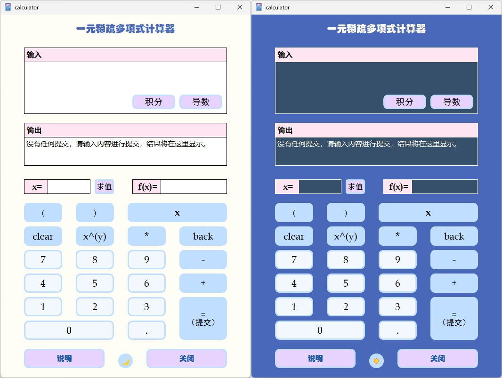

#### 1.2.2 程序的功能说明

- 化简多项式
  - 在输入框中输入 一个多项式，或者两个多项式的和（减\乘）法的形式。
  - 点击 `=(提交)` 按钮 或 按 `Enter` 键
  - 化简结果会在输出框中显示，显示格式为 `f(x) = ...`
- 求导函数
  - 在输入框中输入 一个多项式，或者两个多项式的和（减\乘）法的形式。
  - 点击 `导数` 按钮
  - 求导函数的结果会在输出框中显示，显示格式为 `f(x)' = ...`
- 求积分函数
  - 在输入框中输入 一个多项式，或者两个多项式的和（减\乘）法的形式。
  - 点击 `积分` 按钮
  - 求积分函数的结果会在输出框中显示，显示格式为 `∫f(x)dx = ... +C`

- 求多项式在给定 `x`处的值
  - 在`x=`输入框中输入一个多项式，或者两个多项式的和（减\乘）法的形式。
  - 点击 `求值` 按钮
  - 多项式的化简结果会在大输出框中显示，求得对应的 `f(x)` 的值会在 `f(x)=`输出框中显示

**附加功能**

- 点击计算器中的字符按钮，会在输入框的光标处添加相应的字符或进行相应的输入文本操作
- 点击最下面中间的圆按钮可以更换计算器的UI风格


## 2 程序运行方式

1. 启动程序：双击一元多项式计算器应用程序 `calculator.exe` 以启动程序。
2. 用户界面：在程序启动后，用户将看到一个包含数字按钮、运算符按钮和输入框、结果显示框等组件的用户界面。
3. 多项式的输入以及结果显示：用户可以点击数字按钮以输入数字，点击运算符以及其他符号按钮以输入符号，或者直接通过键盘输入多项式。点击 `= (提交)` 按钮 或 按键盘上的 `Enter` 键可以在输出框中显示化简结果，点击 `导数` 按钮可以在输出框中看到求出的导函数，点击 `积分` 按钮可以在输出框中看到求出的积分函数，在 `x=` 的输入框中输入x的值并在输入框中输入多项式，点击 `求值` 按钮即可在 `f(x) = ` 的输出框中看到相应多项式的值，以及在大的输出框中可以看到多项式化简结果。
4. 关闭程序：在完成计算后，用户直接点击窗口的 `×` 按钮或者 `关闭` 按钮以关闭程序退出。
5. 注意事项：输入的多项式必须有效，才能显示出结果。
6. **输入有效性说明**
   * 本程序只针对一个或两个多项式进行操作，无法对三个及三个以上的多项式进行操作。输入的两个多项式，可以有一个没有括号包围。例如：`6*x^(-3)-x+4.4*x^2-1.2*x^9-(-6*x^(-3)+5.4*x^3-x^2+7.8*x^(15))` 或 `(x+x^(100)) + x^(100) + x^(200)` 。但不能出现包围着多项式的两对括号后面还有其他字符，例如 `(x+x^3)+(2*x+x^2)+x` 是无效的。
   * 多项式中的系数不能用括号包围，例如：`(-4)*x` ，必须写为 `-4*x` 。且必须用 `*` 与未知数相连，除非指数为0。若系数为 1 或 -1，则 1 可以忽略。
   * 对于负的指数和大于等于10的指数必须用括号包围，例如：`x^(-3)` 或 `x^(22)` 。
   * 对于两个多项式相乘，至少要有一个包围多项式的括号，`x^(100)*x^(100)` 和 `8*8` 无效，`x^(100)*(x+x^(100))` 、`(8)*(8)`有效。
7. 部分按钮说明：
   * `clear` ：清空多项式的输入
   * `back` ：删除光标前的一个字符
   * `x^(y)` ：在多项式输入框的光标处加 `^()` ，同时光标移动到括号中间。
   * `说明` ：会有一个弹窗，里面详细介绍了程序的使用方法


## 3 程序运行示例

* 化简合并 相减的两个多项式 `(6*x^(-3)-x+4.4*x^2-1.2*x^9)-(-6*x^(-3)+5.4*x^3-x^2+7.8*x^(15))`

  代入数值 `1.2` 进行求解

  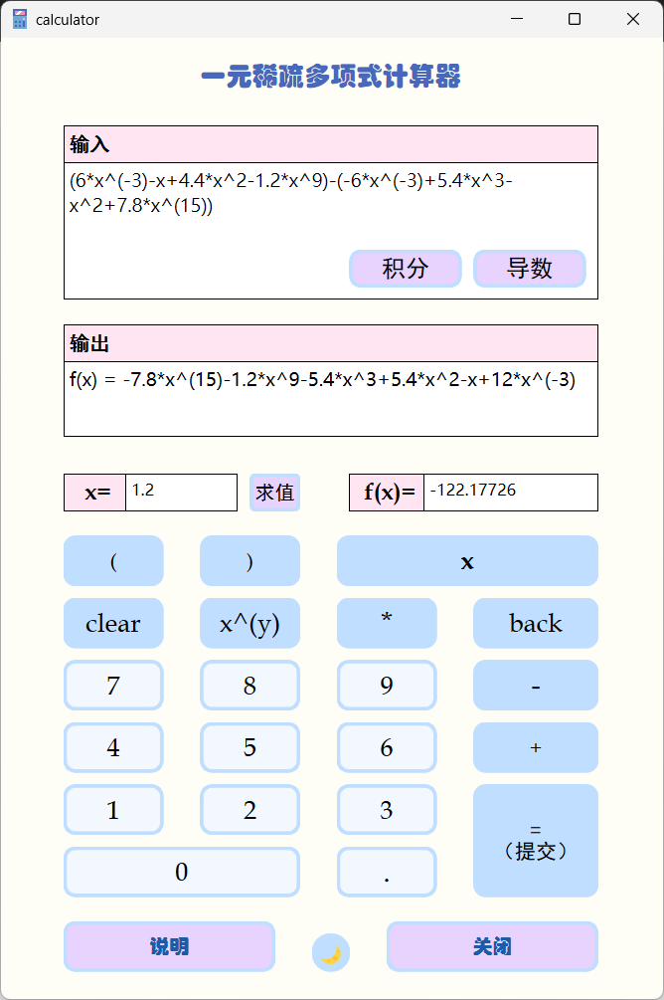

  

* 对 乘积多项式 `(2*x+5*x^8-3.1*x^(11))*(7-5*x^8+11*x^9)` 进行求导

  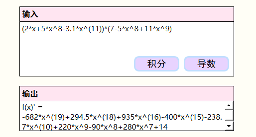

* 对 单个多项式 `6*x^(-3)-x+4.4*x^2-1.2*x^9-6*x^(-3)+5.4*x^3-x^2+7.8*x^(15)` 进行化简

  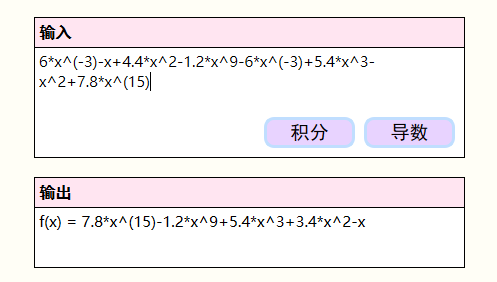

* 对 相加的两个多项式 `(1+x+x^2+x^3+x^4+x^5+x^6)+(-x^3-x^4)` 进行化简

  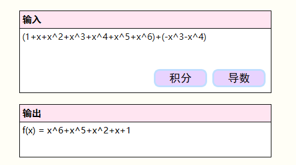

* 对 多项式+数字类型进行化简

  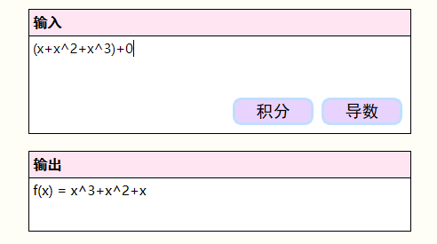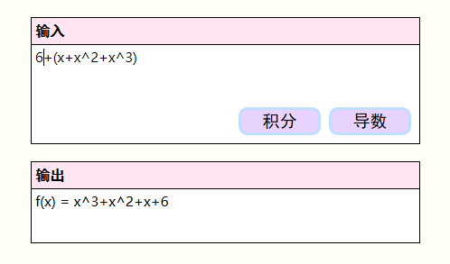

* 相加后为 数字 的多项式

  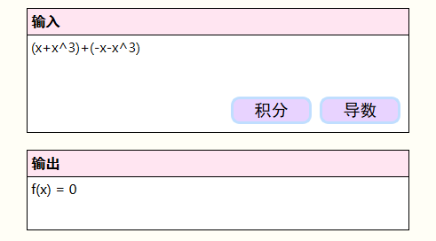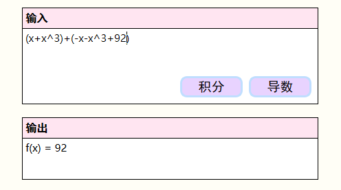
  
* 数字*多项式：

  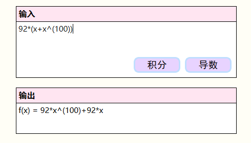

* 单项式*多项式：

  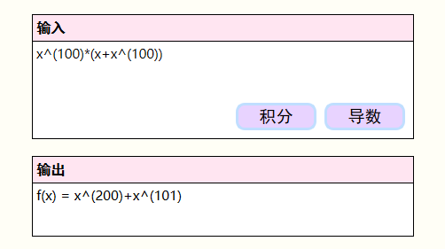

* 求积分函数：

  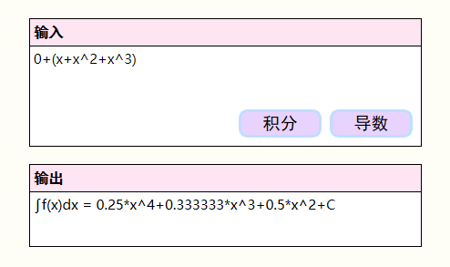


## 4 程序说明

### 4.1 程序介绍

我设计的程序是基于 Qt 框架实现的，具有图形用户界面，可直接通过 `.exe` 可执行文件进行操作。主要功能由 `Calculator` 类来实现，界面设计主要使用 Qt 的组件完成。具有直观的按钮和输入框，能够方便用户输入多项式，且能够实现两个多项式的加减乘运算，以及多项式的求导求积分和求值运算。电脑 

### 4.2 源代码说明

源代码文件由以下文件构成。（`calculator` 为总的文件名称）

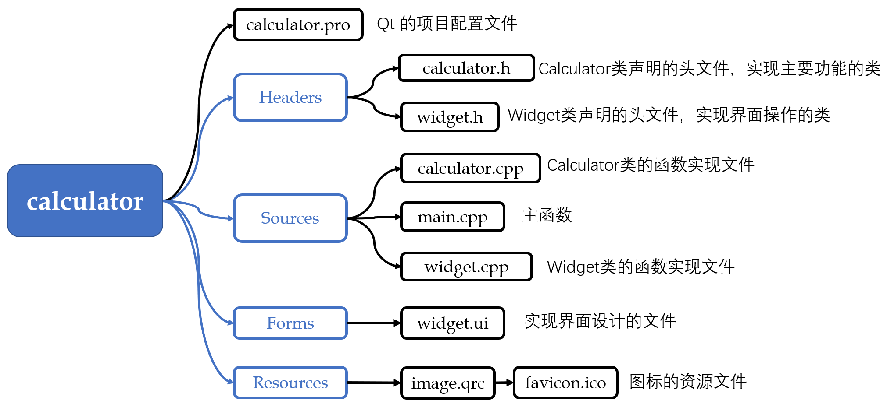

#### 4.2.1 输入有效性判断

**程序说明**

在对多项式进行各种操作之前，首先是要在 `widget.cpp` 中 先**删除多项式中的空白字符**，然后调取 `bool Widget::isValid(std::string& text)` 函数进行**输入多项式有效性**判断：

* 首先判断 **括号是否匹配**。这里我采用 `stack<int>` 的数据结构，进行括号匹配，同时判断是否出现 包围着多项式的两对括号后面还有其他字符 的情况。

```cpp
// 判断 括号是否匹配
std::stack<char> stk;
int cnt = 0;  //包围多项式括号的数目
for(int i = 0; i<(int)(text.length()); i++)
{
    if(text[i] == '(') // 左括号，入栈
    {
        stk.push(i);  // 用 i 代表左括号
    }
    else if(text[i] == ')') //右括号
    {
        if(stk.empty()) //若为空，即不存在匹配的左括号
            return false;  // 输入无效
        else
        {
            int idx = stk.top();
            stk.pop();
            if(stk.empty())  // 说明是外围的括号
            {
                if(idx == 0 || text[idx-1] != '^') // 如果左括号在首位，或者其他位置且不是指数的括号
                {
                    cnt++;
                }
            }
        }

    }
    if(cnt == 2 && i != (int)(text.length()-1)) return false;
}
if(!stk.empty()) return false;  // 若不为空，说明有左括号不匹配
```


* 之后采用 for循环，对每个字符的位置进行合理性判断，用 `if-else` 语句对各种可能出现的符号进行前后字符分类讨论判断。

例如：

```cpp
else if(text[i] == 'x')  //参数
{
    if(i>0 && text[i-1] != '(' && text[i-1] != '+' && text[i-1] != '-' && text[i-1] != '*' )
    {
        return false;
    }
    else if(i < (int)(text.length()-1) && text[i+1] != '^' && text[i+1] != '+' && text[i+1] != '-' && text[i+1] != ')' )
    {
        return false;
    }
}
```


#### 4.2.2 Calculator 类以及程序主要功能的实现

多项式字符串输入判断有效后，将字符串传入Calculator的构造函数中，构造一个 Calculator 对象。

**对 Calculator 类的源代码进行分析**

我采用 `vector<int> exponent` 容器存储 多项式的指数，使用 `map<int,double> expcoef`  容器存储 指数-系数 的键值对，采用类似 **哈希映射** 的方法，直接通过 `expcoef[exp]` 获取 指数对应的系数。我将 **多项式的标准形式** 设置为 `std::pair<std::vector<int>, std::map<int, double>>` ，方便对多项式进行加减乘求导求积分求值操作。

Calculator 类的声明：

```cpp
class Calculator
{
public:
    Calculator(std::string& s); // 构造函数，直接传入多项式的string形式，在函数体内调用 SimplifyPolynomial() 函数对多项式进行格式化
    //与外界接口函数
    std::string GetSimplifiedFx(); // 化简后的多项式
    std::string GetDF(); // 多项式的导函数
    std::string GetFxValue(double x);  //给定x值下的多项式的值
    std::string GetIntFx();
private:
    // 功能 1 化简多项式
    void SimplifyPolynomial();  //提取两个多项式以及之间的符号，调用相应加减乘化简
    std::pair<int, double> GetExpCoef(std::string monomial, int sign); // 获得单项的指数-系数
    std::pair<std::vector<int>, std::map<int, double>> PolyFormat(std::string& polynomial); // 将多项式格式化成 map(指数-系数) 和 vector（指数）
    std::pair<std::vector<int>, std::map<int, double>> PolyProduct(std::string& polynomial1, std::string& polynomial2); // 多项式相乘
    std::pair<std::vector<int>, std::map<int, double>> PolyAdd(std::string& polynomial1, std::string& polynomial2); // 多项式相加
    std::pair<std::vector<int>, std::map<int, double>> PolySubstract(std::string& polynomial1, std::string& polynomial2); //多项式相减

    // 功能 2 求导函数
    std::pair<std::vector<int>, std::map<int, double>> GetDerivative(); // 获取导函数的标准格式

    // 功能 3 求给定 x 的值
    double CalValue(double x);  // 根据给定的 x 值计算 f(x)的数值大小

    // 补充功能 求积分函数
    std::pair<std::vector<int>, std::map<int, double>> GetIntegral(); // 获取积分函数的标准格式，其中 exp = 0代表为 lnx

    // 其他函数
    int StringToNum(std::string& s); // 判断 string 类是否为数字
    int StringToNum(char& s);  // 判断char 类是否为数字
    std::string NumSimplify(std::string s);  // 数字简化：6.0000=>6, 6.50000=>6.5
    std::string FormatToString(std::pair<std::vector<int>, std::map<int, double>>& p,int isIntegral = 0);  // 将 标准格式转换为字符串


    // 数据成员
    std::string fxpolynomial;         // string 类型的多项式
    std::vector<int> fxexponent;      // 存储项的指数
    std::map<int, double> fxexpcoef;  // 存储项的 指数-系数 键值对

};
```


* `Calculator(std::string&); ` ，**构造函数**，将传入的字符串赋值给数据成员 `fxpolynomial` ，然后在构造函数体内，对字符串进行化简操作，调用 `void SimplifyPolynomial();` 函数。


* `void SimplifyPolynomial();` 函数主要根据两个多项式相加减乘的格式特点，以及单个多项式的特点进行分类讨论，然后进行**合并化简**操作。

  * 如果是单个多项式，则直接进行化简操作。
  * 若提取出两个单独的多项式，则根据提取的符号代入相应的加减乘函数中。
  * 最后将调用运算或化简函数返回的新的数据存入对象的数据成员 `fxexponent` 和 `fxexpcoef` 中。

* 在**加减乘函数**中，会先分别进行单个多项式的格式化操作，即调用 `PolyFormat` 函数，然后进行指数和系数的运算操作。

  `std::pair<std::vector<int>, std::map<int, double>> PolyAdd(std::string& polynomial1, std::string& polynomial2)`  **加法** 函数：
  
  ```cpp
  std::pair<std::vector<int>, std::map<int, double>> Calculator::PolyAdd(std::string& polynomial1, std::string& polynomial2)
  {
      std::pair<std::vector<int>, std::map<int, double>> p1 = PolyFormat(polynomial1);
      std::pair<std::vector<int>, std::map<int, double>> p2 = PolyFormat(polynomial2);
  
      std::vector<int> exponent;  // 存储 指数
      std::map<int, double> expcoef;  // 存储 指数-系数
  
      for(auto exp1: p1.first)  // 遍历 第一个多项式的指数
      {
          for(auto exp2: p2.first)   // 遍历 第二个多项式的指数
          {
              if(exp1 == exp2)  // 存在相等的指数，进行系数合并
              {
                  int exp = exp1;
                  double coef = p1.second[exp1] + p2.second[exp2];  // 系数相加
                  if(expcoef.count(exp))  // 原先存在
                  {
                      expcoef[exp] += coef;  // 和原先的系数进行合并
                  }
                  else  //原先不存在，直接存入
                  {
                      expcoef[exp] = coef;
                      exponent.emplace_back(exp);
                  }
              }
          }
      }
  
      // 获取 在另一个多项式中不存在相同指数的 指数对应的系数，直接存入 expcoef 和 exponent 中
      for(auto exp: p1.first)
      {
          if(!expcoef.count(exp))
          {
              expcoef[exp] = p1.second[exp];
              exponent.emplace_back(exp);
          }
      }
      for(auto exp: p2.first)
      {
          if(!expcoef.count(exp))
          {
              expcoef[exp] = p2.second[exp];
              exponent.emplace_back(exp);
          }
      }
  
      // 从大到小对指数进行排序
      std::sort(exponent.begin(), exponent.end(), std::greater<int>());
  
      return std::make_pair(exponent, expcoef);
  }
  ```


* **减法** 函数相似，把加法函数的第一个循环体中 coef 的计算公式的 `+` 改成 `-` ，遍历 p2 的不同指数时，得到结果的系数是 `-1* p2.second[exp]`
* **乘法** 函数，双层遍历，指数相加，系数相乘，得到新的 指数-系数 键值对 存入函数中的 `expcoef` 中，新的指数存入 `exponent` 中，然后合并为 `pair` 类返回。


* `std::pair<std::vector<int>, std::map<int, double>> Calculator::PolyFormat(std::string& polynomial)` ，**格式化函数** ，获取多项式的标准格式 `std::pair<std::vector<int>, std::map<int, double>>` 

  主要是对 传入的字符串，根据 `+` 、`-` 进行判断后，再划分成不同的单项，然后 由函数 `std::pair<int, double> GetExpCoef(std::string monomial, int sign)` 得到单项的 **指数-系数** 键值对，然后存入该单个多项式的 `std::vector<int>exponent` （指数容器）和 `std::map<int, double> expcoef`（指数-系数 键值对容器）中。

  ```cpp
   // 将多项式 格式化 成 map(指数-系数) 和 vector（指数）
  std::pair<std::vector<int>, std::map<int, double>> Calculator::PolyFormat(std::string& polynomial)
  {
      std::vector<int> exponent;  // 存储 指数
      std::map<int, double> expcoef;  // 存储 指数-系数
      int sign = 1;  // 当前项的符号
  
      int i = 0; // 遍历的位置
      if(polynomial[0] == '+') // 特殊情况，首位有符号
      {
          i = 1;
      }
      else if(polynomial[0] == '-')
      {
          sign = -1;
          i = 1;
      }
  
      // 遍历
      int start = i;  // 当前项 开始的位置
      for(i; i<(int)(polynomial.length()); i++)
      {
          if(polynomial[i] == '+' || polynomial[i] == '-' || i == (int)(polynomial.length() - 1))
          { 
              if(i>=2 && polynomial[i-1] == '(' && polynomial[i-2] == '^') continue;
              // 判定 -、+ 号是否是 指数括号里面的，如果不是，则继续下面的操作
              int end = (i == (int)(polynomial.length() - 1)) ? i: i-1; // 单项的结尾位置
              std::pair<int, double> p = GetExpCoef(polynomial.substr(start,end+1-start), sign);
              if(expcoef.count(p.first))
              {
                  expcoef[p.first] += p.second;
              }
              else
              {
                  expcoef[p.first] = p.second;
                  exponent.emplace_back(p.first);
              }
  			// 为下一个 单项的符号数 赋值
              if(polynomial[i] == '+')
              {
                  sign = 1;
              }
              else if(polynomial[i] == '-')
              {
                  sign = -1;
              }
              start = end+2;
          }
      }
  
      std::sort(exponent.begin(), exponent.end(), std::greater<int>());
  
      return std::make_pair(exponent, expcoef);
  }
  ```
  
  

  * `std::pair<int, double> GetExpCoef(std::string monomial, int sign)` ，求 **单项的键值对** 函数，主要是根据单项式的特征使用 `if-else` 语句进行多情况分类讨论，得到相应的指数和系数，然后使用 `make_pair(exp, coef)` 合并成 `pair<int, double>` 类型后返回。


* **求导函数** `    std::pair<std::vector<int>, std::map<int, double>> GetDerivative();` 

  主要是根据多项式求导的方法，对多项式的指数和系数进行处理。

  ```cpp
  std::pair<std::vector<int>, std::map<int, double>> Calculator::GetDerivative() // 获取导函数的标准格式
  {
      std::vector<int> exponent; // 导数的指数容器
      std::map<int, double> expcoef;  // 导数的 指数-系数 键值对容器
  
  
      for(int i = 0; i<(int)(fxexponent.size()); i++)
      {
          int oldexp = fxexponent[i];  // 原来的指数
          double oldcoef = fxexpcoef[oldexp];  //原来的参数
          if(oldexp == 0 || oldcoef == 0)  // 如何系数为0 或 指数为0
              continue;
  		// 根据多项式求导的基本定理，对
          int exp = oldexp -1; // 导数的指数 = 原来的指数-1
          double coef = oldcoef*oldexp;  // 导数的系数 = 原来的指数*原来的系数
          // 新的指数-系数 键值对 存入导数的 指数-系数 键值对容器
          // 因为原来的指数是唯一的，所以求导后的指数也是唯一的，可以直接存入导数的 指数-系数 键值对容器，不需要进行重复判断
          expcoef[exp] = coef;  
          exponent.emplace_back(exp);
      }
  
      return std::make_pair(exponent, expcoef);
  }
  ```


* **求给定 x 的多项式的值**：`double CalValue(double x)` ，使用 `<cmath>` 中的函数 `pow(x,exp)` 乘以系数得到 单项式的值，所有单项式的值相加得到结果。

  ```cpp
  double Calculator::CalValue(double x)  // 根据给定的 x 值计算 f(x)的数值大小
  {
      double result = 0;
  
      for(int i = 0; i < (int)(fxexponent.size()); i++)
      {
          result += fxexpcoef[fxexponent[i]] * pow(x, fxexponent[i]);
      }
      return result;
  }
  ```


* 受求导函数的启发，我为一元稀疏多项式计算器增加一个求**积分函数**的功能，根据积分公式，把求导函数 `std::pair<std::vector<int>, std::map<int, double>> GetDerivative();` 中的求导公式替换为积分公式，同时设定 exp = 0 表示输出 `lnx` ，其他代码不变。

  ```cpp
  if(oldcoef == 0)  // 如果系数为0
      continue;
  // 根据多项式求积分的基本定理
  int exp = oldexp + 1;
  double coef = 0;
  if(exp == 0)
  {
      coef = oldcoef;
  }
  else
  {
      coef = oldcoef/exp;
  }


## 5 实验总结

本次实验设计了一个基于Qt的C++的一元稀疏多项式计算器，在设计过程中，我对 map、vector、stack 容器的使用 以及 C++ 类的封装设计 更加熟悉。但这个程序仍有不足的地方。虽然实现了基本的多项式加减乘运算和导函数、积分函数、求值的功能，但是对于输入多项式的格式要求较高，用户需要按照特定的格式输入多项式，否则程序将判定输入无效，这给输入多项式带来了不便。因此，该程序有可以改进的地方，可以让程序更加灵活地识别多项式格式。


