# Project2 算法表达式求值演示

#### 

## 1 程序功能简要说明

### 1.1 程序目的

利用 **算符优先法** 对算术表达式求值

* 以字符序列的形式从终端输入语法正确的、不含变量的整数表达式。利用 栈 数据结构对数据进行存储操作运算，得到表达式最终的运算结果

* 实现乘方、单目减、赋值等运算

### 1.2 程序功能说明

**1.2.1 程序的运行界面**

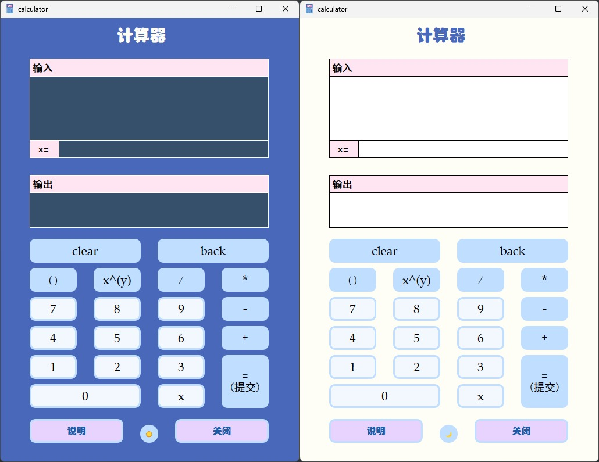

**1.2.2 程序的功能说明**

* 输入 普通表达式，可以键盘输入，也可以按运行界面的按钮输入，然后按下 Enter 键，即可在输出框中看到运算结果
* 输入 一元多项式，然后按下 Enter 键，一元多项式的未知数 x 默认值为 0。可以在 `x=` 输入框中输入一个整数，即给未知数 x 赋值。再按下 Enter 键，运算结果会在输出框中显示。
* 附加功能：按最下方中间按钮，可以实现界面风格更换


## 2 程序运行方式

1. 启动程序：双击一元多项式计算器应用程序 `ExpressionCalculate.exe` 以启动程序。
2. 用户界面：在程序启动后，用户将看到一个包含数字按钮、运算符按钮和输入框、结果显示框等组件的用户界面。
3. 表达式输入以及结果显示：用户可以点击数字按钮以输入数字，点击运算符以及其他符号按钮以输入符号，或者直接通过键盘输入多项式。点击 `= (提交)` 按钮 或 按键盘上的 `Enter` 键可以在输出框中显示结果。在输入多项式的情况下，可以通过 `x=` 的输入框给多项式中的未知数赋值。计算结果会在输出框中显示。
4. 关闭程序：在完成计算后，用户直接点击窗口的 `×` 按钮或者 `关闭` 按钮以关闭程序退出。
5. 注意事项：输入必须有效，才能显示出结果。

6. 输入有效性说明：

   * 所有数字都必须是整数，x 的赋值也是整数

   * 对于负的指数和大于等于10的指数必须用括号包围，例如：`x^(-3)` 或 `x^(22)` 
   * 进行除法运算时，分母不能为 0，指数为负数，底数不能为 0

7. 部分按键说明：

   * `clear` ：清空多项式的输入

   * `back` ：删除光标前的一个字符

   * `x^(y)` ：在多项式输入框的光标处加 `^()` ，同时光标移动到括号中间。

   * `说明` ：会有一个弹窗，里面详细介绍了程序的使用方法


## 3 程序运行示例

**普通运算（包括单目减）：**

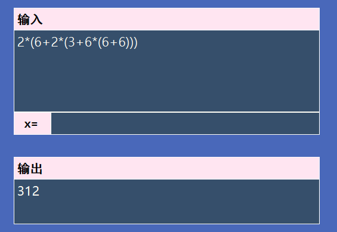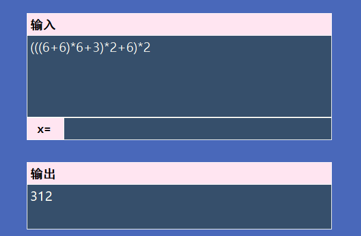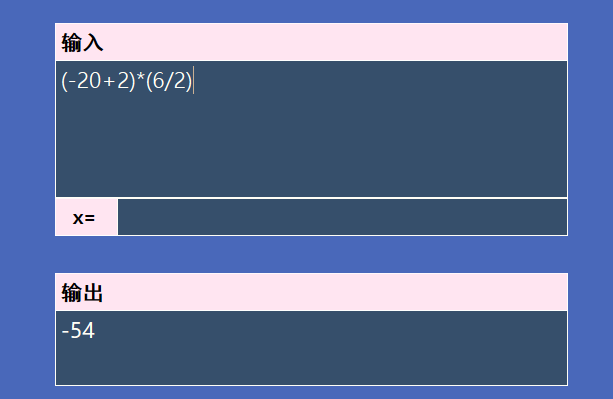

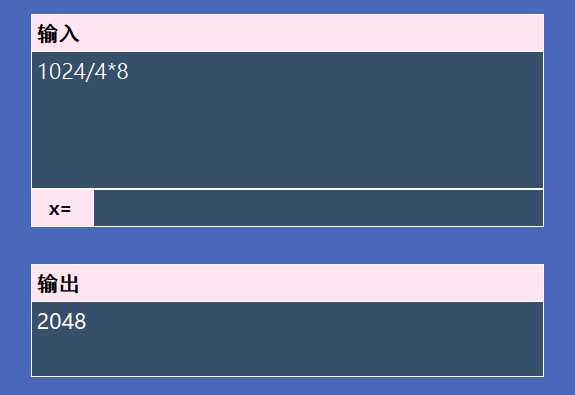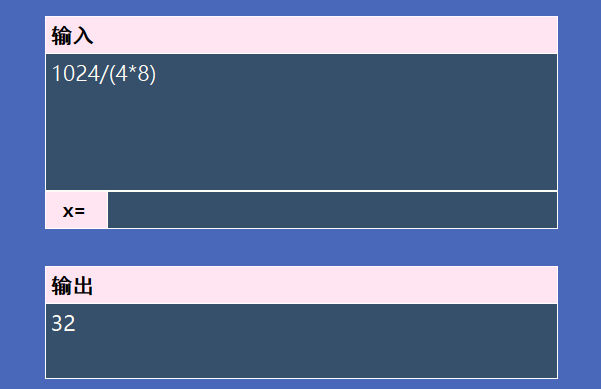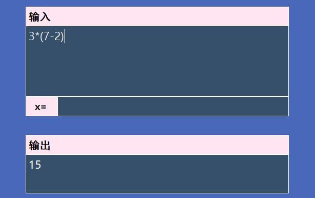

**指数运算**

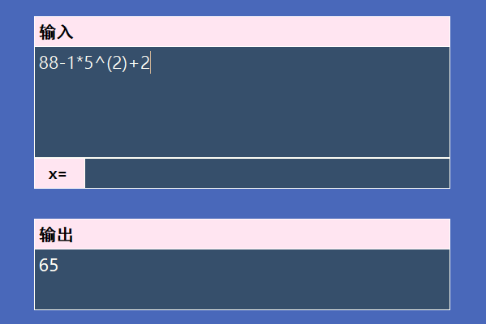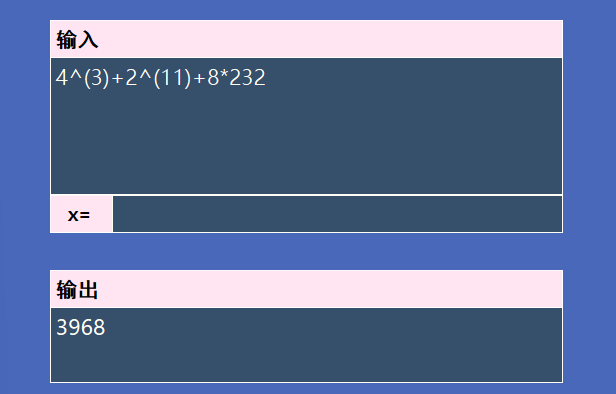

**进行除法运算时，分母不能为 0，指数为负数，底数不能为 0：**

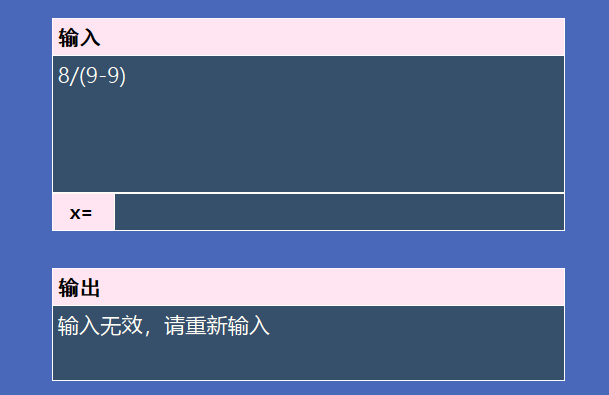 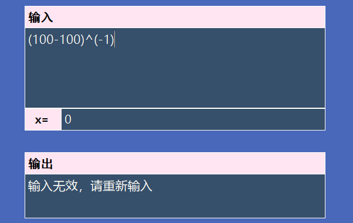

 

**赋值运算**

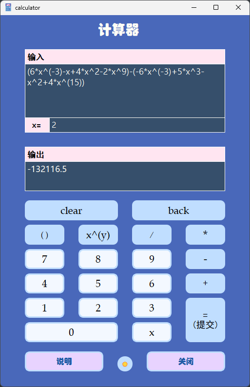

## 4 程序说明

### 4.1 程序介绍

这个程序是基于 Qt 框架实现的，具有图形用户界面，可直接通过 `.exe` 可执行文件进行操作。主要功能由 `Calculator` 类来实现，界面设计主要使用 Qt 的组件完成。具有直观的按钮和输入框，能够方便用户输入。

### 4.2 源代码说明

源代码文件由以下的文件构成。（ExpressionCalculate 为总文件名称）

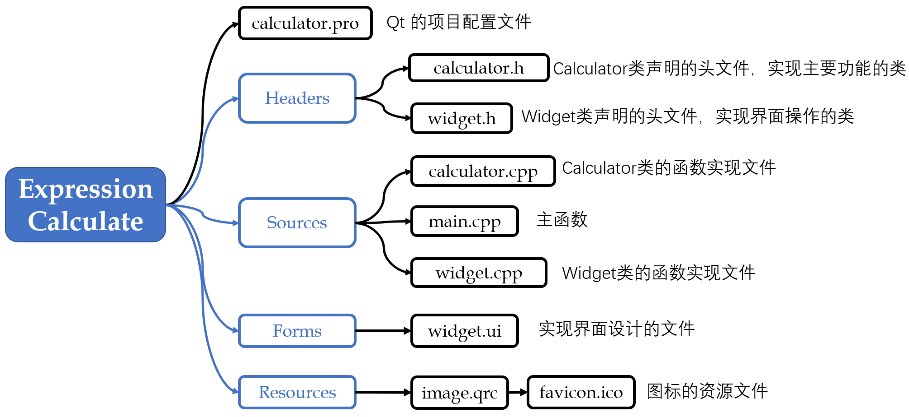

主要功能均在 `Calculator` 类中，实现的主要利用的数据结构为 **栈（stack）**

```cpp
class Calculator
{
public:
    Calculator(std::string& exp, int x = 0);
    // 获取计算结果
    std::string GetResult();
    // 判断计算的式子是否有效（例如计算过程中的除法运算的分母为 0，则无效）
    bool Getisvalid();
private:
    // 表达式计算 的 主要功能函数
    bool ExpCalc();
    bool CalcNum(std::stack<double>&, std::stack<char>&);

    // 把多项式的 x 替换成 xvalue，然后进行 ExpCalc，xvalue 默认为 0
    void PolyToExp(int xvalue);

    // 其他函数
    int StringToNum(std::string& s); // 判断 string 类是否为数字
    int StringToNum(char& s);  // 判断char 类是否为数字
    std::string NumSimplify(std::string s);  // 数字简化：6.0000=>6, 6.50000=>6.5
    bool isPoly();  // 判断是否为包含未知数（是否是多项式）
    bool isValid(int xvlue = 0);  // 判断是否有效

    // 数据成员
    std::string exp;  // 表达式的字符串形式
    double expresult;  // 表达式的计算结果
    bool isvalid = true;  // 是否有效

    // 下面为静态变量，所有类对象共享的数据
    static std::map<char, int> opidx;  // 存储 运算符与 isHigher数组的下标的对应关系：char类型运算符-下标
    static int isHigher[8][8]; // isHigher[left][right] 右边是否比左边的优先级高，-1 左边优先级更高， 0 优先级相等， 1 右边优先级更高
};
```


**计算功能的主函数**：`ExpCalc()` 

**基本思想**：

1. 设置 运算符栈 和 运算数栈。运算符栈的初始：压入字符 `#` 

2. 依次读入每个字符

3. 如果是 **运算数**，则获取整个运算数后压入栈中

4. 如果是 **运算符**，则将 运算符栈的栈顶运算符 与 当前的运算符进行优先级比较：

   * 如果 栈顶运算符优先级 小于 当前的运算符，则将 当前运算符压入栈中

   * 如果 优先级相等，运算符栈 弹栈

   * 如果 栈顶运算符优先级高，弹出两个运算数和一个运算符，进行计算，将计算结果压入运算数栈中。重复 第 4 步

5. 当遍历完后，检查运算符栈是否为空，若不为空，则不断进行 `弹出两个运算数和一个运算符，进行计算，将计算结果压入运算数栈中` 的操作，直到运算符栈为空，即计算完毕

6. 得到的运算数栈顶元素即为最终结果

```cpp
bool ExpCalc()
{
    std::stack<char> opstk;  // 存放 运算符的 栈
    std::stack<double> numstk;  // 存放 数字 的栈

    opstk.emplace('#');  // 栈底标识

    // 遍历计算
    for(int i = 0; i<(int)exp.length(); i++)
    {
        if(std::isdigit(exp[i])) // 如果是数字
        {
            int start = i; // 数字的起始位置
            int cnt = 0;
            while(std::isdigit(exp[i]))
            {
                i++;
                cnt++;
            } // 获取数字区域的范围

            auto numstr = exp.substr(start,cnt);  // 得到数字字符串
            int num = StringToNum(numstr); // 转换数字字符串
            numstk.emplace(num); //把得到的结果压入栈中
            i--; // 防止 i 多加了一次
            continue; // 如果是数字，跳过后面操作
        }
        else if((exp[i] == '-' || exp[i] == '+') && (i == 0 || exp[i-1] == '(')) // 如果是 单目减或加，把 0 压入栈中，可以避免特殊单独处理
        {
            numstk.emplace(0);
        }

        // 运算符，开始栈顶运算符 和 当前遍历到的运算符 进行比较
        while(true)
        {
            int comp = isHigher[opidx[opstk.top()]][opidx[exp[i]]];
            if(comp == 1)  // 当前运算符优先级更高，则将当前运算符压入栈中
            {
                opstk.emplace((char)exp[i]);
                break;
            }
            else if(comp == 0)  // 优先级相等，弹栈
            {
                opstk.pop();
                break;
            }
            else if(comp == -1)  // 当前运算符优先级低，对运算符栈和数字栈进行弹栈，对弹出的运算符进行判断，然后对数字进行相应的操作
            {
                if(!CalcNum(numstk, opstk))  //如果运算失败
                    return false;
            }
        }
    }

    // 将运算符栈中所有运算符弹出，进行相应计算
    while(opstk.top() != '#')
    {
        if(!CalcNum(numstk, opstk))
            return false;
    }

    // 栈顶元素即为结果
    expresult = numstk.top();

    return true;
}
```


操作 `弹出两个运算数和一个运算符，进行计算，将计算结果压入运算数栈中` 的函数 `CalcNum()` ：

主要是对 运算符进行分类讨论，对两个操作数进行相应的运算操作，在运算的时候，判断运算是否有效。

```cpp
bool CalcNum(std::stack<double>& numstk, std::stack<char>& opstk)
{
    // 弹栈操作
    double num1 = numstk.top();
    numstk.pop();
    double num2 = numstk.top();
    numstk.pop();
    char op = opstk.top();
    opstk.pop();

    double num = 0; // 结果
    // 对运算符进行判断，并对弹出两个数字进行相应的运算操作
    if(op == '+')
    {
        num = num1+num2;
    }
    else if(op == '-')
    {
        num = num2-num1;
    }
    else if(op == '*')
    {
        num = num1*num2;
    }
    else if(op == '/')
    {
        if(num1 == 0) return false;  // 进行除法运算时，分母不能为 0
        num = num2/num1;
    }
    else if(op == '^')
    {
        if(num2 == 0 && num1 < 0) return false;  // 指数为负数，底数不能为 0
        num = pow(num2, num1);
    }
    else
    {
        return false;
    }

    numstk.emplace(num); // 把得到的结果压入栈中

    return true;
}
```


对于输入的多项式，将 x 的值代入多项式得到普通表达式的函数 `void PolyToExp(int xvalue)`：主要利用字符串拼接实现

```cpp
void PolyToExp(int xvalue)
{
    std::string numstr = std::to_string(xvalue);
    std::string result;
    for(int i = 0; i<(int)exp.length(); i++)
    {
        if(exp[i] == 'x')
        {
            result += numstr;
        }
        else
        {
            result += exp[i];
        }
    }
    exp = result;
}
```


## 5 实验总结

这次试验中，我成功地利用了 `stack` 结构来完成表达式求值的任务，并在这个过程中积累了更深入的关于数据结构中的栈的知识。一开始，我对如何使用栈的思路相当有限，而且存在一些错误的理解。然后，我决定回顾老师在课堂上教授的栈的理论知识，重新研究了相关课程资料。

通过重新学习栈的理论知识，我对栈在表达式求值中的应用有了更清晰的认识。我明白了栈在维护运算符和操作数的顺序方面的关键作用，以及如何正确使用栈来确保表达式的正确求值顺序。掌握了理论实现的核心概念之后，我便着手进行了代码实现。在这个过程中，我逐步构建了一个能够正确解析和求值表达式的程序。这个经验不仅提高了我的编程技能，还加深了我对栈这一关键数据结构的了解。
