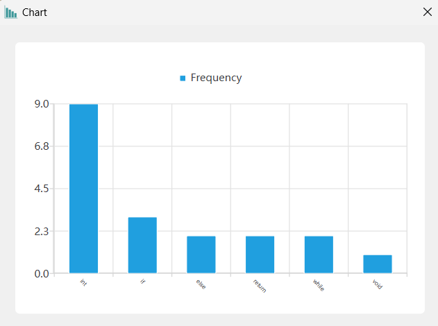

# Project3 文本分析工具

##### 

## 1 程序功能简要说明

### 1.1 程序目的

设计一个文本编辑和分析工具，对文本进行分析统计。

* 对于所有文本文件
  * 文本编辑器基础功能：打开文件，保存文件，编辑文本（剪切、复制、粘贴、重做、撤回）
  * 统计 文本长度、行数、字母数、标点数，实时显示
  * 搜索单个词的功能，然后在文本框中高亮匹配的字符

* 对于 txt 文本
  * 分析 出现频率最大的前 k 个单词，k 由用户设定，同时用 柱状图表示
* 对于 cpp 文本
  * 分析 保留字出现的频率，同时用 柱状图表示
  * 分析 函数、注释、头文件、空白行的个数，同时用 柱状图表示


### 1.2 程序功能说明

#### 1.2.1 程序的运行界面


#### 1.2.2 程序的功能（运行方式）说明

* 点击 `open file` 中的 `open txt file` 打开 `.txt` 文本文件或`open cpp file` 打开 `.cpp` 文件，也可以直接点击 toolbar 上的 `open file` 的图标打开 `.txt` 或 `.txt` 文件，将文本文件内容读入输入框中，或者直接在文本框中输入文字。输入文字可以点击图标或者菜单中的文字进行相应的操作，或者直接使用快捷键操作。
* 点击 `search` （放大镜）图标 或者 按 `ctrl+F` ，表示 单个单词匹配。程序会弹出一个搜索框，在搜索框里输入需要匹配的字符串，然后点击 `find` 按钮，可以输入框中匹配字符串背景高亮。
* 如果打开 `.txt` 文本文件，则可以点击 `Analyse` -> `analyse txt file` -> `the kth words` 进行出现单词频数分析，会出现弹框，k的值默认为 10 ，可以在弹框中输入 k 的值，输出框会实时根据输入更新  前 k 个 出现频率最大的单词以及单词出现的行数。点击 `show chart` 按钮即可看到统计单词和单词频数的柱状图。
* 如果打开 `.cpp` 文本文件，则可以点击 `Analyse` -> `analyse cpp file` -> `frequency of reserved words` 进行保留字频数和出现行数分析，会出现弹窗，弹窗里面输出框显示的是所有出现过的保留字的频数和出现的行数。
* 如果打开 `.cpp` 文本文件，则可以点击 `Analyse` -> `analyse cpp file` -> `detailed analysis` 进行基础信息分析，会出现弹窗，弹窗里面输出框显示的是函数、注释、空白行、头文件的个数。
* 还有一些文本编辑的基础功能：剪切、复制、粘贴、撤回、重做，均可以直接使用快捷键或者点击菜单栏 `Edit` 中的各项，或着点击 `ToolBar` 里面的按钮实现。


## 2 程序运行示例

### 2.1 txt 文件

打开`.txt` 文本文件：


分析 词频Top-K 单词：


点击 `show chart` ：


改变 `k=` 的值为2，并点击 `show chart` ：


直接在主窗口进行单个字符串的匹配搜索，点击 `Analyse -> search` 或 `ToolBar` 上的 `search` 图标（放大镜图标），或者快捷键 `Ctrl+F` ：


`Search` 窗口输入 `you`，再按 `Enter` 键 或 点击 `find` 按钮：


注：这个功能不算是单词匹配，因为我观察到有字符串查找功能的应用（例如一般的文本编辑器、谷歌浏览器）都不是单词匹配而是单纯的字符串匹配，所以这个功能我也是单纯地实现字符串匹配，没有特别地将模式串作为一个单词而去考虑匹配字符串位置前后是否为空格或者其他非字母符号。

### 2.2 cpp 文件


保留字词频分析：




函数、注释、头文件、空白行的个数分析：


## 3 程序说明

### 3.1 程序介绍

这个程序是一个基于Qt框架的文本编辑器，它可以打开.txt和.cpp文件，支持文本编辑功能（剪切、复制、粘贴、撤销和重做），具备查找功能，可以高亮显示匹配文本，以及文本分析功能，包括单词频率和保留字分析，可以帮助编辑和分析文本文件。

实现源代码概要：


### 3.2 源代码说明

这个程序的核心就是 `Word` 类。

类的声明，`Word.h`：

```cpp
class Word
{
public:
    Word();
    Word(QString& qword); // 传入 QString 字符串，方便直接对源字符进行单个字符串匹配
    Word(std::string word, int freq = 0);
    bool operator<(const Word& w); // 重载运算符，便于进行 sort 操作

    void WordInLine(std::string s, int linenumber);// KMP 算法，判断词是否在这个字符串中，这个字符串存储的是一行字符串，linenumber对应的行字符串对应原来文本的行号，在判断 word 在s中后把行号存入 lines 容器中。
    void GetNext();// 获取 next 数组，string 版本
    void QStrGetNext();// 获取 next 数组，QString 版本
    std::vector<int> FindAllPos(QString& text); // 用于单个模式串的匹配，返回 qword 在 text 中的所有位置，方便文本高亮显示

    std::string word; 
    QString qword;
    int freq;  // 频数
    std::vector<int> next;  // next 数组
    std::vector<int> lines;
};
```

`Word.cpp` 分析

* 重载运算符`<` ，方便进行 `sort` 操作：

  ```cpp
  /******      重载运算符<，便于进行 sort 操作      ******/
  bool Word::operator<(const Word& w)
  {
      if(freq == w.freq) return word < w.word;  // 字典顺序小的排在前面
      return freq > w.freq; // 出现频率大的排在前面
  }
  ```

* KMP算法的实现，在这里我对 KMP 算法进行小小的修改，进行词汇判断，因为匹配的是单词，所以匹配成功后还需要判断对应的匹配成功的字符串前后是否为字母，如果是，那就不成立。例如 `integer` 不能匹配到 `int` ，`your` 不能匹配到 `you` 。

  ```cpp
  // KMP算法的主函数
  void Word::WordInLine(std::string s, int linenumber)
  {
      int i = 0, j = 0;  // 初始化两个指针 i 和 j 为 0
      while (j < (int)word.length() && i < (int)s.length())
      {
          if (j == -1 || s[i] == word[j])  // 如果 j 为 -1 或者当前字符匹配成功
              i++, j++;  // 移动 i 和 j
          else
              j = next[j];  // 不匹配时，根据 next 数组更新 j
  		
          // 判断字符串前后是否为字母
          if(j == (int)word.length() && ((i<(int)s.length() && std::isalpha(s[i]))||(i-(int)word.length()-1>=0 && std::isalpha(s[i-(int)word.length()-1]))))
          {
              j = 0;  // 如果找到完全匹配的子串，且其前后字符为字母，则重置 j 为 0
          }
      }
  
      if (j == (int)word.length())
          lines.emplace_back(linenumber);  // 如果 j 等于子串长度，说明找到了匹配，将行号添加到结果集合中
  }
  
  // 获取 next 数组
  void Word::GetNext()
  {
      int i = 0, j = -1;
      next.emplace_back(-1);  // 初始化 next 数组，第一个元素为 -1
      while (i < (int)word.length())
      {
          if (j == -1 || word[i] == word[j])
          {
              i++, j++;  // 如果字符匹配成功，移动 i 和 j
              if ( i < (int)word.length() && word[i] == word[j])
              {
                  next.emplace_back(next[j]);  // 如果下一个字符仍匹配，更新 next 数组
              }
              else
                  next.emplace_back(j);
          }
          else
              j = next[j];  // 如果字符不匹配，根据已知的 next 值更新 j
      }
  }
  ```
  
* 找到模式串在文本中出现的所有位置，实现单个模式串的匹配，这个功能我参照一般文本编译器的搜索字符的功能实现效果，并不针对词汇进行匹配，不需要进行匹配位置前后的判断，只要出现了这个模式串就算匹配成功，然后进行下一个位置的查找：

  ```cpp
  /******      找到单词出现的所有位置      ******/
  // 在给定的文本字符串 text 中查找子字符串 qword 出现的所有位置
  std::vector<int> Word::FindAllPos(QString& text)
  {
      std::vector<int> res;  // 用于存储子字符串 qword 出现的位置的结果集合
      if (text.isEmpty() || qword.isEmpty())  // 如果文本或要查找的单词为空，直接返回空结果
          return res;
  
      int i = 0, j = 0;  // 初始化两个指针 i 和 j 为 0
  
      while (i < (int)text.length())  // 循环遍历文本字符串
      {
          if (j == (int)qword.length())  // 如果 j 等于子字符串长度，表示找到一个匹配
          {
              res.emplace_back(i - j);  // 将匹配位置的起始索引添加到结果集合
              j = 0;  // 重置 j 为 0，准备继续查找下一个匹配
              continue;
          }
  
          if (j == -1 || text[i] == qword[j])  // 如果 j 为 -1 或当前字符匹配成功
          {
              i++, j++;  // 移动 i 和 j
          }
          else
          {
              j = next[j];  // 不匹配时，根据 next 数组更新 j，以提高匹配效率
          }
      }
  
      // 判断文章末尾的情况
      if (j == (int)qword.length())  // 如果 j 等于子字符串长度，表示找到一个匹配
      {
          res.emplace_back(i - j);  // 将匹配位置的起始索引添加到结果集合
      }
  
      return res;  // 返回包含所有匹配位置的结果集合
  }
  
  // 获取 next 数组
  void Word::QStrGetNext()
  {
      int i = 0, j = -1;
      next.emplace_back(-1);  // 初始化 next 数组，第一个元素为 -1
      while (i < (int)qword.length())
      {
          if (j == -1 || qword[i] == qword[j])
          {
              i++, j++;  // 如果字符匹配成功，移动 i 和 j
              if (i < (int)qword.length() && qword[i] == qword[j])
              {
                  next.emplace_back(next[j]);  // 如果下一个字符仍匹配，更新 next 数组
              }
              else
                  next.emplace_back(j);
          }
          else
              j = next[j];  // 如果字符不匹配，根据已知的 next 值更新 j
      }
  }
  ```
  
  

`Analysis` 类分析

* 类的声明：

  ```cpp
  class Analysis
  {
  public:
      Analysis(std::string& text);
  
  protected:
      void SplitTextToLines(); // 把文本拆分成不同的行
      void GetWordLines(std::vector<Word>& wordvec);  // 获取所有单词所在的行数（把行数信息都是存入到 Word对象自身的 lines 容器里面）
  
  
      std::string text;  // 文本信息
      std::map<std::string, int> wordFrequency;  // 词-词频 键值对容器
      std::vector<std::string> textLines;  // 存储单个行的字符串的容器
      std::vector<Word> words;  // 存储 Word 的容器
  };
  ```

* 获得每个单词对应的行数 的功能的函数 `GetWordLines` 的实现，就是按照要求文档里面提供的思路，按照一行一行的方式进行 KMP 匹配判断：

  ```cpp
  // 获得每个单词对应的行数
  void Analysis::GetWordLines(std::vector<Word>& wordvec)
  {
      for(int i = 0; i<(int)wordvec.size(); i++)
      {
          for(int j = 0; j<(int)textLines.size(); j++)
          {
              wordvec[i].WordInLine(textLines[j], j+1);
          }
      }
  }
  ```

  

`TxtAnalysis` 类的声明：

```cpp
class TxtAnalysis: public Analysis
{
public:
    TxtAnalysis(std::string& text);
    std::vector<Word> GetKthWords(int k = 10);  // 获取词频前 k 的单词，k 默认为 10 

private:
    void GetAllWordFreq();  // 获得所有词出现的频数
};
```

* **获得所有单词的词频**，主要是根据字符串的字符判断，把连续出现的字母字符连成一个单词，存入 `wordFrequency` 键值对容器中，然后遍历 键值对容器，把所有单词的 频数、单词信息存入 Word 容器 words 里面，最后对 words 容器进行排序操作：

  ```cpp
  // 获得所有单词的词频
  void TxtAnalysis::GetAllWordFreq()
  {
      for(int i = 0; i<(int)text.length(); i++)
      {
          while(!std::isalpha(text[i])) i++; // 不是字母，跳过
          std::string word;
          while(std::isalpha(text[i]))  // 如果是字母
          {
              word+=text[i]; // 把字母拼接到单词中
              i++;
          }
          wordFrequency[word]++;
      }
  	
      // 遍历键值对，把 所有单词的词频、单词的信息存入 Word的vector容器words中
      for(auto it = wordFrequency.begin(); it != wordFrequency.end(); it++)
      {
          words.emplace_back(it->first,it->second);
      }
  	
      // 进行排序操作
      sort(words.begin(), words.end());
  }
  ```

* **获得词频最大的前 k 个单词**，主要是把 `words` 容器的下标为 0 到 k-1 的 Word 存入 `kthwords` 中并返回。

  ```cpp
  // 获得词频最大的前 k 个单词，默认为10
  std::vector<Word> TxtAnalysis::GetKthWords(int k)
  {
      std::vector<Word> kthwords;
      for(int i = 0; i<k && i<(int)words.size(); i++)
      {
          kthwords.emplace_back(words[i]);
      }
  
      GetWordLines(kthwords);  // 获得所有传入的单词的出现行数的信息
  
      return kthwords;
  }
  ```

  

`CppAnalysis` 类的声明：

```cpp
class CppAnalysis: public Analysis
{
public:
    CppAnalysis(std::string& s);
    std::vector<Word> GetWords();  // 获取保留字的信息的对外接口
    int GetFunctionCount();  // 获取函数数量
    int GetCommentCount();  // 获取注释数量
    int GetBlankLineCount();  // 获取空白行数量
    int GetHeaderFileCount();  // 获取头文件数量


private:
    void GetReservedWord();  // 获取保留字信息的主要功能函数
    bool isReservedWords(const std::string& word); // 判断是否是保留字
    void CalcFunctionCount();  // 计算函数数量
    void CalcCommentCount();  // 计算注释数量
    void CalcBlankLineCount();  // 计算空白行数量
    void CalcHeaderFileCount();  // 计算头文件数量

    // 详细的统计信息
    int functionCount;
    int commentCount;
    int blankLineCount;
    int headerFileCount;
};
```

* 利用 正则表达式匹配 并计算各个 参数的数量，例如 函数数量的计算：

  ```cpp
  // 函数的数量
  void CppAnalysis::CalcFunctionCount()
  {
      // 使用正则表达式来匹配函数定义
      std::regex functionPattern(R"((\w+)\s+(\w+)\s*\([^)]*\)\s*\{)");
      std::sregex_iterator iter(text.begin(), text.end(), functionPattern);
      std::sregex_iterator end;
  
      functionCount = 0;
      while (iter != end)
      {
          functionCount++;
          ++iter;
      }
  }
  ```

* **cpp 保留字的出现的频率和出现的行数**，就是在进行 词-词频 键值对 添加的时候，增加了保留字的判断，如果是保留字，就添加入 键值对容器中。

  ``` cpp
  /******      得到保留字的出现频率和出现的行数      ******/
  // 功能函数
  void CppAnalysis::GetReservedWord()
  {
      for(int i = 0; i<(int)text.length(); i++)
      {
          while(!std::isalpha(text[i])) i++;
          std::string word;
          while(std::isalpha(text[i]))
          {
              word+=text[i];
              i++;
          }
          if(isReservedWords(word)) // 判断单词是否为保留字，如果是，则放入 map 中
              wordFrequency[word]++;
      }
  	
      // 把 词-词频 键值对添加入 Word 的 vector容器中
      for(auto it = wordFrequency.begin(); it != wordFrequency.end(); it++)
      {
          words.emplace_back(it->first,it->second);
      }
  	
      // 按照词频大小排序
      sort(words.begin(), words.end());
  	
      // 得到容器中每个单词的出现的行号，存放在单个Word各自的std::vector<int> lines中 
      GetWordLines(words);
  }
  ```

  


## 4 实验总结

在最初设计字符串频数的统计的时候，我并没有单独设计一个 `Word` 类来存储单词的信息和频数，函数的返回值类型和输入类型都比较复杂，不容易理解。在设计了 `Word` 类之后，代码可读性就有所提升。

一开始设计程序的时候，思路不清晰，导致我写完关键功能代码后，整个代码文件很乱，且有很多重复代码，文件命名也不统一。之后在设计单个字符串匹配搜索的时候，我重写了代码，并且设计了 `Analysis` 类，来减少 实现`.txt` 和 `.cpp` 文本分析类的代码的重复。

在调试功能的正确性的时候，我一开始只使用一个较长的 .txt 文本进行功能测试，在测试 单个字符串匹配搜索的功能的时候，我试了很多个模式串都测试成功了，我还以为功能没有问题。在写实验报告的时候，我使用了另一个较长的文本进行测试，发现我的 文本中模式串高亮的位置有偏差，去网上查资料才发现， string 类的 某个char字符和 QString 类的对应的 QChar 字符得到的字符串中的位置是有差异的，因此，我为 Word 类专门设计了一个 传入 QString 对象的构造函数和一个 QString类的数据成员，把 `FindAllPos` 的参数类型都改为 QString，之后得到的模式串的位置才正确。

这次项目的实现，让我对 KMP算法的实现和应用有了更深入的理解，对一个代码编辑器和分析器的实现有了更深入的认识。
