# Project 4 表达式类型的实现

##### 

## 1 程序功能简要说明

### 1.1 程序目的

实现基于二叉树表示的算术表达式 Expression 的操作。算术表达式 `Expression` 内可以含有变量 `(a~z)` 、常量 `(0~9)` 和二元运算符 `(+,-,*,/,^(乘幂))`  。程序实现的功能：

* 读取输入的正确的前缀表达式
* 可以以中缀表达式输出表达式
* 实现对中缀表达式中的变量赋值，变量初值为 0
* 根据赋值来计算算术表达式E
* 合并两个表达式形成复合表达式

* 可以实现简单的三角函数
* 可以实现常数运算合并的操作 `MergeConst(E)` 的操作
* 实现算术二叉树的可视化


### 1.2 程序功能说明

#### 1.2.1 程序的运行界面

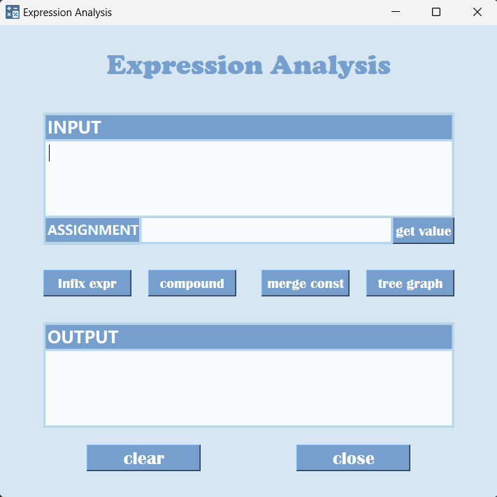

#### 1.2.2 程序的功能（运行方式）说明

打开 exe 可执行程序运行程序，在 INPUT 输入框中输入 前缀算术表达式，点击 `Infix expr` ，即可在输出框中看到中缀算术表达式。

* 在 ASSIGNMENT 输入框中输入 对变量的赋值，例如 `a = 1, b = 2` ，点击 `get value` 按钮即可在输出框中看到赋值后的运算结果

* 在 INPUT 输入框中输入

  ```
  expression1
  operator
  expression2
  ```

  格式的字符串，例如：

  ```
  + * 3 ^ * 3 * 2 ^ x 2 x 6
  +
  + * 3 ^ * sin(17) * 2 ^ x 2 x 6
  ```

  点击`compound` 按钮，即可在输出框中看到两个表达式复合的结果

* 对于输入的前缀算术表达式，点击 `merge const` ，即可在输出框中看到，合并常数之后的算术表达式
* 点击 `tree graph` ，即可看到算术表达式的二叉树图
* 该程序能实现简单的三角函数运算，例如 `sin(x)` 或 `sin(23)` 


## 2 程序运行示例

获取中缀表达式：

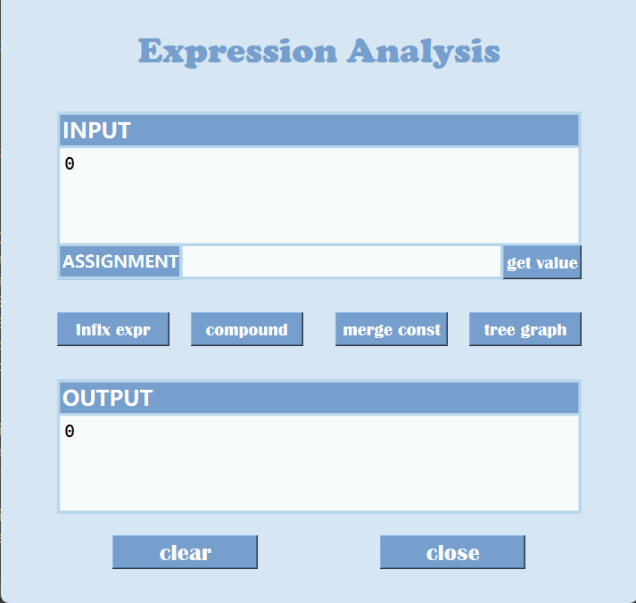

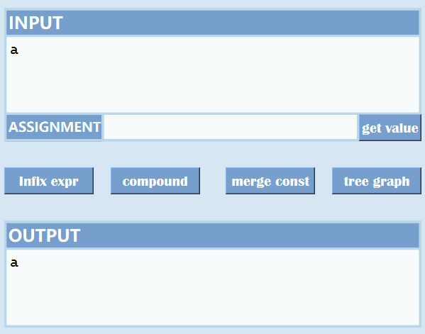

【注】输入的表达式，不同运算符和运算数之间要有空格

赋值功能：

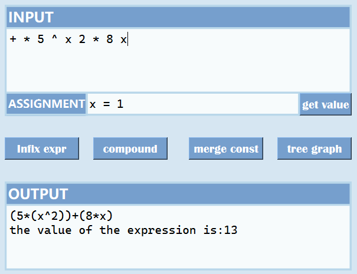

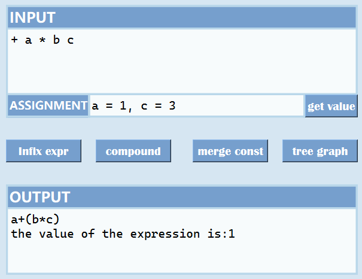

合并常数运算：

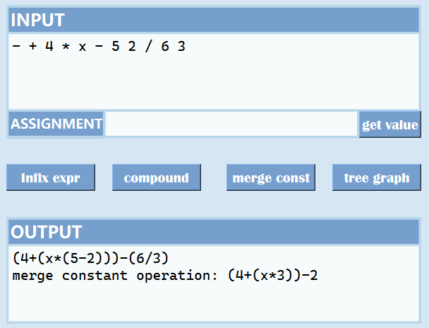

合并表达式：

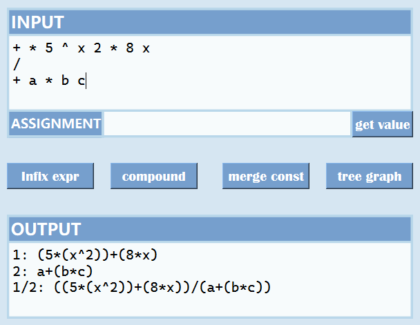

表达式二叉树输出：

`* - + 2 a 3 + b * 3 4` 

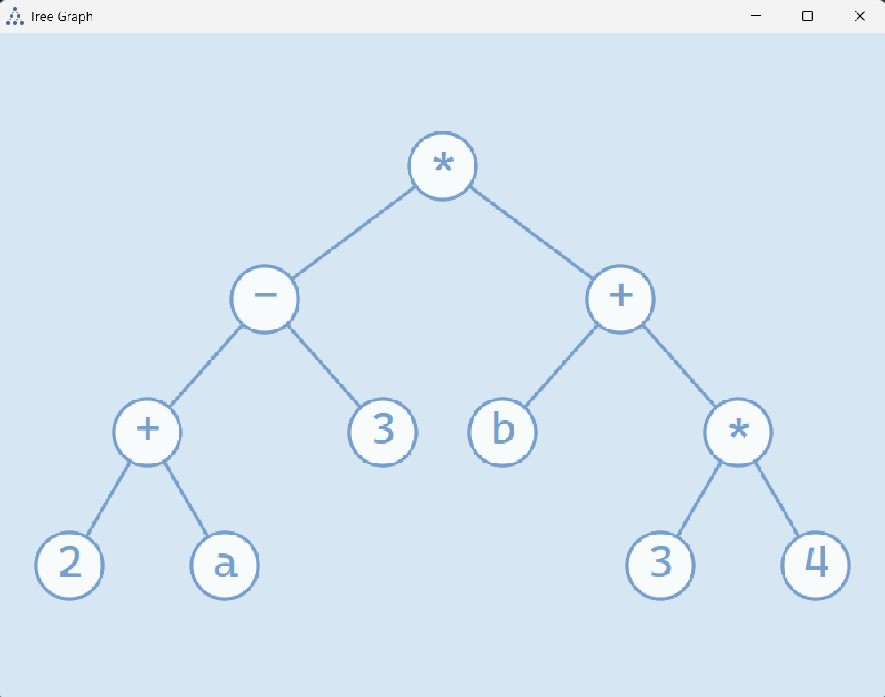

`\+ * 3 ^ * sin(x) * 2 ^ x 2 x 6` ：

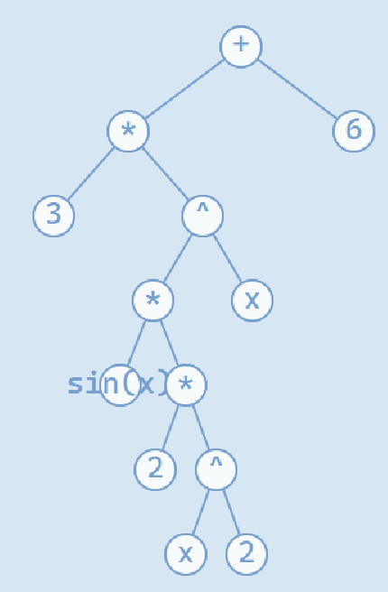


错误输入判断：

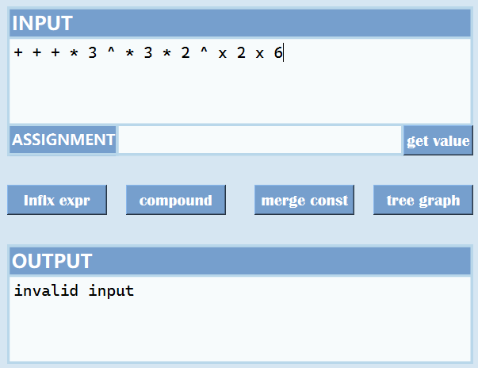

* 普通求中缀表达式，不对运算正确性进行判断，但是点击求表达式值和合并常数运算会进行判断：

  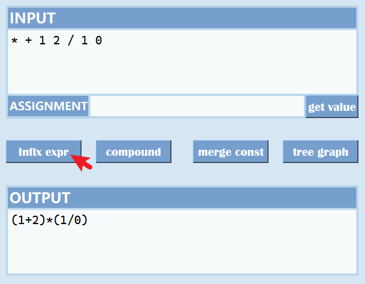


## 3 程序说明

### 3.1 程序介绍

这是基于 Qt GUI 框架实现的算术表达式分析程序，其主要思想是利用二叉树实现对表达式的分析。实现了 读取前缀表达式、输出中缀表达式、复合两个表达式、合并常数运算、在给定未知量的赋值后对表达式的值进行计算、显示算术表达式的二叉树的图像。

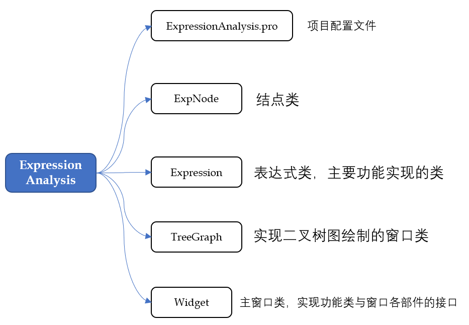

### 3.2 源代码说明

### 3.2.1 结点类

结点类 `ExpNode` ：

```cpp
class ExpNode
{
public:
    ExpNode();
    ExpNode(std::string);
    bool isLetter();    // 判断是否是字母
    bool isNum();       // 判断是否是数字
    bool isOperator();  // 判断是否是运算符
    bool isTriFunc();   // 判断是否是三角函数

    std::string c;      // 存储运算数或运算符
    ExpNode* left;      // 左子树
    ExpNode* right;     // 右子树
    int x,y;            // 绘图时候的 x,y 坐标
};
```

结点类的函数都比较简单，都是作一些结点存储数据类型的判断。


### 3.2.2 表达式类

表达式类`Expression` ：

```cpp
class Expression
{
public:
    Expression();
    Expression(std::string);
    ~Expression();
	
    std::string GetInfix();                   // 获取中缀表达式
    ExpNode* GetNodes();                      // 获取结点，绘图要用
    double GetExpValue(std::string varInput); // 获取给定变量的赋值后的表达式的值
    void CompoundExpr(Expression &newE, std::string op, Expression &E); // 合并表达式
    bool MergeConst();                         // 合并常数项的运算

    bool isValid();
    bool isCalValid();
    
    

private:
    void PrefixToNodes();                        //前缀表达式转化为表达式二叉树
    void NodesToInfix(ExpNode* root);            // 结点转为中缀表达式
    double CalExpValue(ExpNode* root, std::map<char, double> varVal);      // 计算表达式的值
    void SetPrefix(std::string prefix);          // 设置前缀表达式的值
    void MergeConst(ExpNode* &root);             //合并常数运算

    void DeleteNodes(ExpNode* &root);            //删除二叉树
    std::string SimplifyNumString(std::string s);// 化简数字字符串
    void CutHeadAndTailSpace(std::string& s);    // 删除字符串前后空白字符

    // 基本判断函数
    bool isNum(std::string& s);
    bool isNum(char c);
    bool isLetter(std::string& s);
    bool isLetter(char s);
    bool isOperator(std::string &c);
    bool isOperator(char c);
	// 字符串转为数字
    double StringToNum(std::string& s);
    double StringToNum(char& s);

    // 数据
    bool isvalid;        // 判断输入的前缀公式是否有效
    bool isCalvalid;     // 判断输入的变量赋值后的公式是否有效
    std::string prefix;  // 前缀表达式
    std::string infix;   // 中缀表达式
    ExpNode* expRoot;    // 表达式树的根节点
};
```


#### 将前缀表达式转为结点

主要是利用 `stack` 栈结构，对前缀表达式进行分析，将运算符和运算数存入表达式二叉树中

```cpp
void Expression::PrefixToNodes()
{
    // 创建一个字符串输入流，以便逐个读取前缀表达式中的字符
    std::istringstream iss(prefix);
    std::string c;
	
    // 处理特殊情况
    // 如果第一个字符不是运算符，根据前缀表达式的特点就知道
    // 这个表达式肯定是一个变量或者一个数字（若是正确表达式的前提下）
    if(!isOperator(prefix[0]))
    {
        if(isTriFunc(prefix))  // 如果是三角函数，进行有效性输入判断
        {
            std::string subs = prefix.substr(4,prefix.length()-6);
            if(!isNum(subs) && !isLetter(subs))
            {
                isvalid = false;
                return;
            }
        }
        else if(!isNum(prefix) && !isLetter(prefix)) // 如果既不是数字和变量
        {
            isvalid = false;
            return;
        }
        // 是数字或变量，则直接把它存进一个结点，然后返回
        expRoot = new ExpNode(prefix);
        return;
    }

    // 对于一般情况，利用栈的数据结构对结点进行分析合并
    std::stack<ExpNode*> stk;
    while(iss >> c)
    {
        ExpNode* term = new ExpNode(c);

        if(!term->isOperator())  // 变量或数字，说明要和之前出现的运算符结合
        {
            if(stk.empty()) // 如果为空，说明没有运算符，说明表达式错误
            {
                isvalid = false;
                return;
            }
			
            // 如果前一个结点左右子树都满了，则说明这个运算数和前一个表达式
            // 有一个运算符相连
            if(stk.top()->left && stk.top()->right)
            {
                // 把左右子树都满的结点弹出来
                ExpNode* preop = stk.top(); stk.pop();
                if(stk.empty()) // 这时，如果栈为空，说明表达式错了
                {
                    isvalid = false;
                    return;
                }
                // 左右子树都满的运算符结点连接在前面出现的运算符结点上
                stk.top()->left = preop;
                // 连接运算数的操作放在下面的 if 语句中
            }
            
            // 如果前一个结点左子树上连接了一个运算数或者运算符
            // 说明前一个结点右子树为空，可以连接这个运算数
            if(stk.top()->left)
            {
                stk.top()->right = term;
                // 此时左右子树都满了，要和前面的左右子树都有的运算符
                // 或者只有左子树的运算符结点进行合并
                while(stk.size() > 1)
                {
                    ExpNode* op = stk.top(); stk.pop();
                    // 前一个运算符结点左右子树都满
                    // 说明要和之前的一个运算符合成
                    if(stk.top()->left && stk.top()->right)
                    {
                        ExpNode* preop = stk.top(); stk.pop();
                        if(stk.empty())
                        {
                            isvalid = false;
                            return;
                        }
                        stk.top()->left = preop;
                        stk.top()->right = op;
                    }
                    // 如果前面的运算符结点只有左子树
                    // 说明这个运算符结点是它的右子树
                    else if(stk.top()->left)
                    {
                        stk.top()->right = op;
                    }
                    else
                    {
                        stk.emplace(op);
                        break;
                    }
                }
            }
            else // 左右子树都空
                stk.top()->left = term;
        }
        else
        {
            // 如果是运算数，直接入栈
            stk.emplace(term);
        }
    }

    // 如果栈里面有两个以上的运算符或者没有运算符，或者这个运算符左右子树有为空的
    // 则说明前缀表达式输入错误
    if(stk.size() != 1 || !stk.top()->left || !stk.top()->right) isvalid = false;

    expRoot = stk.top();
}
```


#### 表达式二叉树转为中缀表达式

主要利用递归，逐步处理结点和左右子树

```cpp
void Expression::NodesToInfix(ExpNode* root)
{
    if(!root->isOperator())  // 结点不操作数
    {
        infix += root->c;    // 直接存入输出的 string类型的中缀表达式 infix
    }
    else
    {
        if(root != expRoot)  // 如果不是根节点，可以使用括号括起来
            infix += "(";
        NodesToInfix(root->left);  // 先处理左子树
        infix += root->c;          // 添加运算符
        NodesToInfix(root->right); // 再处理右子树
        if(root != expRoot)
            infix += ")";
    }
}
```


#### 计算赋值后表达式的值

主要利用 哈希映射（存储变量和变量的值）和递归思想对表达式二叉树进行分析。

```cpp
// 对输入的赋值表达式进行分析，将不同变量和值存储到 键值对容器里
double Expression::GetExpValue(std::string varInput)
{
    std::istringstream iss(varInput); 
    std::map<char, double> varVal;     // 变量-值 键值对容器
    char c;       // 存储变量名称
    char equalop; // 存储 = 运算符
    double value; // 存储变量被赋予的值

    while(iss >> c >> equalop >> value)
    {
        if(!isLetter(c) || equalop != '=')
        {
            isCalvalid = false;
            return 0;
        }
        varVal.emplace(c, value);
        if(!(iss>>c)) break;
    }
    isCalvalid = true;
    return CalExpValue(expRoot, varVal);
}

// root 根节点，方便进行递归计算
// map<char, double> varVal, 存储 字符-值 的键值对容器
double Expression::CalExpValue(ExpNode* root, std::map<char, double> varVal)
{
    // 如果赋值错误，直接退回
    if(!isCalvalid) return 0;
    
	// 对三角函数作特殊判断
    if(root->isTriFunc())
    {
        std::string str = root->c.substr(4,root->c.length()-5);
        // 如果三角函数的参数是变量
        if(str.size() == 1 && isLetter(str[0]))
        {
            double var;
            if(!varVal.count(str[0])) var = 0;
            else var = varVal[str[0]];
            
            if(root->c[0] == 's')
                return sin(var);
            else
                return cos(var);
        }
        else if(isNum(str)) // 如果三角函数的参数是数字，直接计算
        {
            if(root->c[0] == 's')
                return sin(stod(str));
            else
                return cos(stod(str));
        }
        else  // 其他情况，说明表达式错误
        {
            isCalvalid = false;
            return 0;
        }
    }
    
	// 如果是数字,直接返回原本的值
    if(root->isNum()) return stod(root->c);
    // 如果是变量,直接返回变量被赋予的值
    if(root->isLetter())
    {
        if(!varVal.count(root->c[0])) return 0;  // 如果变量没有被赋值,直接赋0
        return varVal[root->c[0]];
    }
	
    // 如果是运算符
    double num1, num2;
    // 直接计算左右子树
    num1 = CalExpValue(root->left, varVal);
    num2 = CalExpValue(root->right, varVal);
    if(!isCalvalid) return 0;
	
    // 判断运算符符号，进行相应的运算，同时进行赋值是否合理的判断
    if(root->c == "+") return num1+num2;
    else if(root->c == "-") return num1-num2;
    else if(root->c == "*") return num1*num2;
    else if(root->c == "^")
    {
        if(num1 < 1e-9 && num2 < 0)
        {
            isCalvalid = false;
            return 0;
        }
        return pow(num1, num2);
    }
    else
    {
        if(num2 < 1e-9)
        {
            isCalvalid = false;
            return 0;
        }
        return num1/num2;
    }

}
```


#### 合并常数运算

主要利用递归操作对根节点和左右子树进行分析判断，合并常数项的运算。

```cpp
// 合并常数运算，调用合并常数运算的递归函数
void Expression::MergeConst()
{
    if(!isvalid) return;
    MergeConst(expRoot);
}

void Expression::MergeConst(ExpNode* &root)
{
    if(!isvalid) return;
    if(!root)return;
    if(root->isNum()) return;  // 是数字不做处理
    // 判断是否是三角函数，同时判断参数是否是常数
    if(root->isTriFunc())
    {
        std::string subs = root->c.substr(4,root->c.length()-5);
        if(isNum(subs))
        {
            double val;
            if(root->c[0] == 's') val = sin(StringToNum(subs));
            else val = cos(StringToNum(subs));
            root->c = std::to_string(val);
        }

        return;
    }

    
    // 先对左右子树进行处理
    MergeConst(root->left);
    MergeConst(root->right);
	// 合并左右子树
    if(root->left && root->right)
    {
        // 左右都是数字，则进行合并运算操作
        if(root->left->isNum() && root->right->isNum())
        {
            double num1 = StringToNum(root->left->c);
            double num2 = StringToNum(root->right->c);
            double result;
            // 对运算符进行分析，并进行相应的运算操作 
            if(root->c == "+") result = num1+num2;
            else if(root->c == "-") result = num1-num2;
            else if(root->c == "*") result = num1*num2;
            else if(root->c == "^")
            {
                if(num1 < 1e-9 && num2 < 0)
                {
                    isvalid = false;
                    return;
                }
                result = pow(num1, num2);
            }
            else
            {
                if(num2 < 1e-7)
                {
                    isvalid = false;
                    return;
                }

                result = num1/num2;
            }
			// 修改结点，使其存储数值
            root->c = SimplifyNumString(std::to_string(result));
            // 删除左右子树结点
            delete root->right;
            delete root->left;
            root->left = nullptr;
            root->right = nullptr;
        }
    }
}
```


#### 合并表达式

这个操作比较简单，就是利用 前缀表达式 的特点，将运算符和第一个表达式、第二个表达式的前缀表达式连接，就形成了合并和表达式的前缀表达式：

```cpp
void Expression::CompoundExpr(Expression &newE, std::string op, Expression &E)
{
    std::string newPrefix = op+" "+prefix+" " +E.prefix;
    newE.SetPrefix(newPrefix);
}
```


## 4 实验总结

这次项目让我对二叉树的结构更加熟悉，对二叉树的递归实现各种操作更加熟悉，同时让我对前缀表达式转为中缀表达式的操作更加熟悉。同时学会灵活运用多种数据结构对数据进行处理，例如在绘二叉树图的时候分析树的深度，利用 `queue` 队列结构进行深度分析，以及处理子树和根节点的坐标关系；在前缀表达式转为二叉树的时候，参考之前表达式转换的思路，利用 `stack` 栈结构实现对表达式分析和二叉树的构建。

