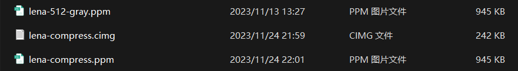

# Project 5 简单图像处理程序

##### 

## 1 程序功能简要说明

### 1.1 程序目的

实现对图像放缩、旋转、灰度处理、色彩变化和利用三元组解压缩处理。图像为 ppm 格式，文件内容容易处理，利用矩阵知识能够对图像进行简单的操作。

### 1.2 程序功能说明

#### 1.2.1 程序的运行界面


#### 1.2.2 程序的功能（运行方式）说明

1. 可以点击工具栏的按钮实现简单的图像操作功能，例如：上传图片，保存图片，放大、缩小（只是视觉上的放大缩小），逆时针或顺时针旋转90度，退出程序。
2. 点击菜单栏，不仅可以实现上述简单操作，可以实现更加复杂的操作，例如：
   * 改变图片尺寸（有固定的尺寸选项）
   * 滤镜操作：黑白（图像灰度化）、暖色调、冷色调、复古色调、反色
   * 压缩图片，并保存压缩后的特定格式的图片文件
   * 导入压缩后的特定格式的图片文件并对其进行解压显示
3. 图片操作仅支持 `.ppm` 格式图片，压缩图片文件后缀为 `.cimg` 
4. 要实现改变图片尺寸，只能通过点击菜单栏，实现图像固定几种大小的改变。
5. 点击菜单栏的 "清空" ，可以把图片显示窗口清空。

测试文件的建议：文件路径<u>最好不要包含中文</u>

## 2 程序运行示例

导入图片：


图像灰度化：

 

滤镜（暖色调、冷色调、复古、反色）：


图像放大、缩小（点击菜单栏改变图片尺寸实现）：

 

如果直接点击工具栏的放大和缩小（可以小范围放大缩小），只能出现视觉上的放大和缩小，图像实现的类并没有改变。（这个功能是直接利用 QImage 自带的函数实现）

图片旋转：


**图像压缩**

简单图像压缩：


简单图像能实现高压缩比，对于上面这幅图，压缩比为 ： 129/1754

图像恢复：


保存压缩后的图像文件：


看图软件查看：

 


较为复杂图片压缩：

 

lena 的黑白 512*512 图像的压缩比：242/954

恢复：

  

更加复杂的图像（长颈鹿的图片）：

 

压缩比：1153/2885

 

 

有 1KB 差距是因为原图文件中像素信息部分有换行符，我自己输出的图像格式的像素信息没有换行符，所以图像大小会小一点点，看图软件也能正常显示：

 


## 3 程序说明

### 3.1 程序介绍

该图像程序基于 Qt GUI 图形界面，有菜单栏和工具栏，能够实现读入图像，并在界面中心显示图像，图像压缩，压缩图像文件解码并显示解码后图像，图像滤镜（灰度图像、暖色、冷色、反色、复古滤镜），图像尺寸改变，顺时针逆时针旋转。

测试程序的运行系统版本：windows 11

源文件基本信息：


### 3.2 源代码说明

图像操作，基本不依赖 Qt 自带的 QImage，QImage 只用于展示图像和视觉上小范围放大缩小图像（就是工具栏的放大缩小按钮会用到）。其他各种复杂操作均由 PPMimage 类 和 ImageCompress 类实现。


#### 3.2.1 PPMimage

**类的声明**

```cpp
struct Pixel{
    int R, G, B;
    Pixel(int R = 0, int G = 0, int B = 0): R(R), G(G), B(B){}
    void SetRGB(int r = 0, int g = 0, int b = 0)
    {
        R = r, G = g, B = b;
    }
};

class PPMimage
{
public:
    // 构造函数
    PPMimage();
    PPMimage(const PPMimage& pimg);
    PPMimage(std::string filePath);
    PPMimage(std::string type, int width, int height, int max_val, std::vector<Pixel>& matrix);
    // 重载运算符
    void operator=(const PPMimage& pimg);
    
    // 保存图片
    void SavePpmImage(std::string filePath);
    
	// 获取图像信息的接口
    std::string GetType();
    int GetMaxVal();
    int GetWidth();
    int GetHeight();
    std::vector<Pixel>& GetPMatrix();
	
    // 滤镜
    PPMimage BlackImage();
    PPMimage WarmColor();
    PPMimage CoolColor();
    PPMimage OldColor();
    PPMimage ReverseColor();
    // 改变图片大小
    PPMimage ChangeBigSize(int coef);
    PPMimage ChangeSmallSize(int coef);
    // 图像旋转
    PPMimage ClockwiseRotate();
    PPMimage AntiClockwiseRotate();

private:
    void CalcItem(int l, int r, int b, int t, int coef, std::vector<Pixel>& matrix);

    std::string type;
    int width, height, max_val;
    std::vector<Pixel> pmatrix;
};
```


以文件路径作为参数的构造函数：

```cpp
PPMimage::PPMimage(std::string filePath)
{
    std::ifstream file(filePath, std::ios::binary);
    file >> type >> width >> height >> max_val;     // 读取基本信息
    int r, g, b;
    for(int i = 0; i<width*height; i++)
    {
        // 分类，判断读入图像类型
        if(type == "P2")        // 灰度图像
        {
            file >> r;
            g = b = r;          // 灰色图像每个像素点的 RGB 值相同
        }
        else if(type == "P3")   // RGB 图像
        {
            file >> r >> g >> b;
        }
        pmatrix.emplace_back(r, g, b);
    }

    file.close();
}
```


**图像灰度化**

```cpp
PPMimage PPMimage::BlackImage()
{
    PPMimage res(*this);
    for(Pixel& p: res.pmatrix)
    {
        int grey = (p.R + p.G + p.B)/3;   // 灰度值取三种颜色值的均值
        p.SetRGB(grey, grey, grey);       // 将 RGB 的三个参数设置相同就说明是灰度图形
    }
    return res;
}
```


**图像放大**

原理：双线性插值

求解步骤：

1. x 方向单线性插值：
   $$
   f(x,y_1) = \cfrac{x_2-x}{x_2-x_1}f(x_1,y_1)+\cfrac{x-x_1}{x_2-x_1}f(x_2,y_1)\\
   f(x,y_2) = \cfrac{x_2-x}{x_2-x_1}f(x_1,y_2)+\cfrac{x-x_1}{x_2-x_1}f(x_2,y_2)
   $$

2. y 方向但线性插值
   $$
   f(x,y) = \cfrac{y_2-y}{y_2-y_1}f(x,y1)+\cfrac{y-y_1}{y_2-y_1}f(x,y_2)
   $$

将第一步结果代入第二步 得到：

$f(x,y) = & \cfrac{f(x_1,y_1)}{(x_2-x_1)(y_2-y_1)}(x_2-x)(y_2-y)+\cfrac{f(x_2,y_1)}{(x_2-x_1)(y_2-y_1)}(x-x_1)(y_2-y)\\ & +\cfrac{f(x_1,y_2)}{(x_2-x_1)(y_2-y_1)}(x_2-x)(y-y_1)+\cfrac{f(x_2,y_2)}{(x_2-x_1)(y_2-y_1)}(x-x_1)(y-y_1)$ 


根据上述公式实现特定倍数的放大操作：

```cpp
PPMimage PPMimage::ChangeBigSize(int coef) // coef 为放大的比例
{
    int w = width*coef, h = height*coef;
    std::vector<Pixel> matrix(w*h);
    for(int i = 0; i<height; i++)
    {
        for(int j = 0; j <width; j++)
        {
            // 双线性插值，计算给定范围内的像素点的 RGB 值
            CalcItem(j,j+1, i, i+1, coef, matrix);
        }
    }

    return PPMimage(type, w, h, max_val, matrix);
}
// 双线性插值，计算一定范围内的像素点的 RGB 值
void PPMimage::CalcItem(int l, int r, int b, int t, int coef, std::vector<Pixel>& matrix)
{
    int w = width*coef, h = height*coef;
    int divisor = coef*coef, pl = l*coef, pr = r*coef, pt = t*coef, pb = b*coef;
    Pixel P1,P2,P3,P4;
    
    // 特殊情况处理
    if(pr == w && pt == h)
    {
        P4 = P3 = P2 = P1 = pmatrix[l+b*width];
    }
    else if(pr == w)
    {
        P2 = P1 = pmatrix[l+b*width], P4 = P3 = pmatrix[l+t*width];
    }
    else if(pt == h)
    {
        P3 = P1 = pmatrix[l+b*width], P4 = P2 = pmatrix[r+b*width];
    }
    else
    {
        P1 = pmatrix[l+b*width], P2 = pmatrix[r+b*width], P3 = pmatrix[l+t*width], P4 = pmatrix[r+t*width];
    }

    for(int i = pl; i<=pr; i++)
    {
        if(i >= w) continue;      // 数值越界判断
        for(int j = pb; j<=pt; j++)
        {
            if(j >= h) continue;  // 数值越界判断
            if((i == pl || i == pr) && (j == pb && j == pt))
            {
                Pixel P = pmatrix[i/coef+j/coef*width];
                matrix[i+j*w].SetRGB(P.R, P.G, P.B);
                continue;
            }
            int c1 = (pr-i)*(pt-j), c2 = (i-pl)*(pt-j), c3 = (pr-i)*(j-pb), c4 = (i-pl)*(j-pb);
            matrix[i+j*w].R =  ((double)P1.R/divisor)*c1 + ((double)P2.R/divisor)*c2 + ((double)P3.R/divisor)*c3 + ((double)P4.R/divisor)*c4;
            matrix[i+j*w].G =  ((double)P1.G/divisor)*c1 + ((double)P2.G/divisor)*c2 + ((double)P3.G/divisor)*c3 + ((double)P4.G/divisor)*c4;
            matrix[i+j*w].B =  ((double)P1.B/divisor)*c1 + ((double)P2.B/divisor)*c2 + ((double)P3.B/divisor)*c3 + ((double)P4.B/divisor)*c4;
        }
    }
}
```


**图像缩小**

原理简单，均匀采点作为新图像的像素点。

```cpp
PPMimage PPMimage::ChangeSmallSize(int coef)
{
    int w = width/coef, h = height/coef;
    std::vector<Pixel> matrix(w*h);
    for(int i = 0; i<height/coef; i++)
    {
        for(int j = 0; j<width/coef; j++)
        {
            Pixel P = pmatrix[(i*coef+1)*width+j*coef+1];
            matrix[i*w+j].SetRGB(P.R,P.G,P.B);
        }
    }
    return PPMimage(type, w, h, max_val, matrix);
}
```


**图像旋转**

就是对图像进行坐标变换。

```cpp
// 顺时针旋转 90度
PPMimage PPMimage::ClockwiseRotate()
{
    std::vector<Pixel> matrix(width*height);
    int newwid = height, newheight = width;

    for(int i = 0; i<width; i++)
    {
        for(int j = 0; j<height; j++)
        {
            // 计算像素点旋转后的新坐标
            int new_j = i;
            int new_i = height-j-1;
            matrix[new_i+new_j*newwid] = pmatrix[i+j*width];
        }
    }
    return PPMimage(type,newwid, newheight, max_val, matrix);
}

// 逆时针旋转 90度
PPMimage PPMimage::AntiClockwiseRotate()
{
    std::vector<Pixel> matrix(width*height);
    int newwid = height, newheight = width;

    for(int i = 0; i<width; i++)
    {
        for(int j = 0; j<height; j++)
        {
            int new_j = width-i-1;
            int new_i = j;
            matrix[new_i+new_j*newwid] = pmatrix[i+j*width];
        }
    }
    return PPMimage(type,newwid, newheight, max_val, matrix);
}
```


**图片保存**

```cpp
void PPMimage::SavePpmImage(std::string filePath)
{
    std::ofstream file;
    file.open(filePath, std::ios::out | std::ios::trunc);
    file << type << "\n" << width << " " << height << "\n" << max_val << "\n";
    for(Pixel p: pmatrix)
    {
        // 判断图片类型, P3--RGB格式保存, P2--灰度值保存
        if(type == "P3")
            file << p.R << " " << p.G << " " << p.B << " ";
        else if(type == "P2")
            file << p.R << " ";
    }
    file.close();
}
```


#### 3.2.2 ImageCompress

图像压缩，基本思想是哈夫曼编码。每一个哈夫曼编码代表一个 RGB 值，所以在图像简单的情况下，能实现较高的压缩比。

**类的声明**

```cpp
class ImageCompress
{
public:
    ImageCompress();
    void SaveCompressedImage(PPMimage& pimg, std::string filename);  // 保存压缩后的图像文件
    PPMimage DecompressedImage(std::string cmpimgfile);              // 解压 压缩文件
    ~ImageCompress();

private:
    // 结点结构
    struct TreeNode{
        int value;
        long long weight;
        TreeNode* left, *right;
        std::string code;
        TreeNode(int value = 0, long long weight = 0, TreeNode*left = nullptr, TreeNode* right = nullptr):value(value), weight(weight), left(left), right(right){}
    };

    // 初始化参数
    void Init();

    // 编码时使用的函数
    void CalcWeight(std::vector<Pixel>& pmatrix);  // 计算每个结点的权值（频数）， 构建键值对容器
    void BuildTree();                                                   //构建哈夫曼编码树
    void CodeTreeNode(TreeNode* root);                                  // 遍历树，对叶子结点进行编码
    void SaveInFile(PPMimage& pimg, std::string filename);              // 把压缩文件的二进制内容写入文件
    void WirteBinaryString(std::string& encodeText, std::fstream& out); // 把表示string类文本表示的二进制内容写入文件中

    // 解码时使用的函数
    PPMimage GetDecodeImage(std::string filename);  // 解码的总函数，返回图像的 PPMimage 格式
    void ConstructMatrix(std::vector<Pixel>& pmatrix, std::string& codeText); // 根据二进制编码构建 像素点矩阵
    void RebuildTree();            // 根据哈夫曼编码表，重构哈夫曼树
    void ConstructNode(const int& value, int pos, std::string& code, TreeNode*& root); // 构建结点(RebuildTree函数要用)
    std::string DecodeBinaryFile(int len, std::fstream& file);                  // 读出二进制内容

    // 清空树
    void ClearTree(TreeNode*& root);

	// 谓词，在利用 priority_queue 构建哈夫曼树的时候要用
    struct nodePtrCmp{
        bool operator()(TreeNode* a, TreeNode* b)
        {
            return (a->weight)>=(b->weight);
        }
    };
    
    // 数据成员
    TreeNode* treeRoot;  // 哈夫曼树根节点
    std::unordered_map<int, int> freqMap;  // 频数
    std::unordered_map<int, std::string> huffmanCodeMap;  // 哈夫曼编码映射表
};
```


**【图像压缩】**

```cpp
void ImageCompress::SaveCompressedImage(PPMimage& pimg, std::string filename)
{
    Init();  // 初始化数据
    CalcWeight(pimg.GetPMatrix());   // 计算各像素点权重
    BuildTree();                     // 构建哈夫曼树
    CodeTreeNode(treeRoot);          // 给哈夫曼树结点编码，同时存入哈夫曼编码映射表中
    SaveInFile(pimg, filename);      // 保存压缩文件
}
```

**计算各像素点权重**

```cpp
void ImageCompress::CalcWeight(std::vector<Pixel>& pmatrix)
{
    for(Pixel& p: pmatrix)
    {
        int value = p.R*1000000+p.G*1000+p.B;   // 把三元组的形式转为一个数字, 方便后续操作
        if(freqMap.count(value))
            freqMap[value]++;
        else
            freqMap[value] = 1;
    }
}
```

**构建哈夫曼编码树**

利用 priority_queue 不断选择权值最小的两个结点构成新结点，新结点入队。

```cpp
void ImageCompress::BuildTree()
{
    std::priority_queue<TreeNode*, std::vector<TreeNode*>, nodePtrCmp> nodeQueue;
    // 把计算得到的频数映射表转为结点存入优先队列中
    for(auto it = freqMap.begin(); it!=freqMap.end(); it++)
    {
        TreeNode* node = new TreeNode(it->first, it->second);
        nodeQueue.emplace(node);
    }

    while(nodeQueue.size() > 1)
    {
        // 获取两个权值最小的结点
        TreeNode* right = nodeQueue.top(); nodeQueue.pop();
        TreeNode* left = nodeQueue.top(); nodeQueue.pop();
        // 合成新结点存入队列中
        TreeNode* parent = new TreeNode(0,right->weight+left->weight,left, right);
        nodeQueue.emplace(parent);
    }
    treeRoot = nodeQueue.top();
}
```

**获取哈夫曼编码映射表**

```cpp
void ImageCompress::CodeTreeNode(TreeNode* root)
{
    if(!root) return;
    if(!root->left && !root->right)
    {
        // 如果是叶子结点，就把编码和对应的 RGB 值存入哈夫曼映射表中
        huffmanCodeMap.emplace(root->value, root->code);
        return;
    }
    // 左子树的根节点 + '0'
    if(root->left)
    {
        root->left->code = root->code+'0';
        CodeTreeNode(root->left);
    }
    // 右子树的根节点 + '1'
    if(root->right)
    {
        root->right->code = root->code+'1';
        CodeTreeNode(root->right);
    }
}
```

**保存压缩文件**

显示保存图片文件的基本信息，再保存哈夫曼编码的映射表，最后保存 图片的像素信息的哈夫曼二进制编码

```cpp
// 把压缩文件的二进制内容写入文件
void ImageCompress::SaveInFile(PPMimage& pimg, std::string filename)
{
    std::fstream file;
    file.open(filename, std::ios::out | std::ios::trunc | std::ios::binary);
    // 写入图像基本信息，便于恢复图像
    file << pimg.GetType() << '\n' << pimg.GetWidth() << ' ' << pimg.GetHeight() << '\n' << pimg.GetMaxVal() << '\n' << huffmanCodeMap.size() << '\n';

    // 把哈夫曼编码表写入文件，用来重构图像的哈夫曼树
    for(auto it = huffmanCodeMap.begin(); it!=huffmanCodeMap.end();it++)
    {
        file << it->first << ' ';
        file << it->second.length() << ' ';
        WirteBinaryString(it->second, file);
        file << ' ';
    }

    // 构建 二进制文件内容
    std::string encodeText;
    for(Pixel&p: pimg.GetPMatrix())
    {
        int RGB = p.R*1000000+p.G*1000+p.B;
        std::string code = huffmanCodeMap[RGB];
        encodeText+=code;
    }

    // 写入 根据哈夫曼编码得到新的图像的二进制信息
    file << encodeText.length() << '\n';
    WirteBinaryString(encodeText, file);
    file.close();
}

// 把表示string类文本表示的二进制内容写入文件中
void ImageCompress::WirteBinaryString(std::string& encodeText, std::fstream& out)
{
    int Tbits = 0;
    char buf = 0;
    for (char c : encodeText)
    {
        if (Tbits == 8)
        {
            out.put(buf);
            out.flush();
            buf = Tbits = 0;
        }
        unsigned char mask = 1;
        if (c == '1')
        {
            mask = mask << (7 - Tbits);
            buf = buf | mask;
        }
        if (c == '0')
        {
            mask = mask << (7 - Tbits);
            mask = ~mask;
            buf = buf & mask;
        }
        Tbits++;
    }

    if (Tbits)
    {
        out.put(buf);
        out.flush();
    }
}
```


**【解码】**

```cpp
PPMimage ImageCompress::DecompressedImage(std::string cmpimgfile)// 解压 压缩文件
{
    Init();
    return GetDecodeImage(cmpimgfile);
}
```

**解码的总函数**，返回图像的 PPMimage 格式

```cpp
PPMimage ImageCompress::GetDecodeImage(std::string filename)
{
    std::fstream file;
    file.open(filename, std::ios::in | std::ios::binary);
    std::string type;
    int width, height, max_val, mapsize;  // 读入基本信息
    file >> type >> width >> height >> max_val >> mapsize;

    for(int i = 0; i<mapsize; i++)
    {
        int RGB, codelen;
        file >> RGB >> codelen;

        file.get(); // 读取 空格，避免空格读入code
        std::string code = DecodeBinaryFile(codelen, file);

        huffmanCodeMap.emplace(RGB, code.substr(0,codelen));
    }

    int codeTextLen;
    file >> codeTextLen;

    std::string line;
    std::getline(file, line);//读入换行，避免换行符读入 code
    std::string encodeText = DecodeBinaryFile(codeTextLen, file);

    // 重构哈夫曼编码树
    RebuildTree();
    // 获取图像的 像素点矩阵
    std::vector<Pixel> pmatrix;
    ConstructMatrix(pmatrix, encodeText);

    file.close();

    return PPMimage(type, width, height, max_val, pmatrix);
}
// 根据给定二进制位位数，读出二进制内容
std::string ImageCompress::DecodeBinaryFile(int len, std::fstream& file)
{
    std::string code;
    char buf = 0;
    int nbits = 8;
    int t = len;
    while(t>0)
    {
        if(nbits == 8)
        {
            buf = file.get();
            nbits = 0;
        }

        unsigned char mask = 1;
        mask = mask << (7-nbits);
        mask = mask & buf;
        nbits++;
        if(mask == 0)
        {
            code += '0';
        }
        else
        {
            code += '1';
        }
        t--;
    }
    return code;
}
```

**重构哈夫曼树**

```cpp
// 根据哈夫曼编码表，重构哈夫曼树
void ImageCompress::RebuildTree()
{
    treeRoot = new TreeNode;
    for(auto it = huffmanCodeMap.begin(); it != huffmanCodeMap.end(); it++)
    {
        ConstructNode(it->first, 0, it->second, treeRoot);
    }
}

// 构建结点
void ImageCompress::ConstructNode(const int& value, int pos, std::string& code, TreeNode*& root)
{
    // 到达编码对应的结点
    if(pos == (int)code.length())
    {
        root->value = value;
        root->code = code;
        return;
    }

    if(code[pos] == '0')
    {
        if(!root->left) root->left = new TreeNode;
        ConstructNode(value, pos+1, code, root->left);
    }
    else
    {
        if(!root->right) root->right = new TreeNode;
        ConstructNode(value, pos+1, code, root->right);
    }
}
```

根据二进制编码构建像素点矩阵

```cpp
void ImageCompress::ConstructMatrix(std::vector<Pixel>& pmatrix, std::string& codeText)
{
    int pos = 0;
    TreeNode* node = treeRoot;
   
    while(pos < (int)codeText.length())
    {
        if(codeText[pos] == '0')  // 0 代表左子树
        {
            node = node->left;
        }
        else if(codeText[pos] == '1')  // 1 代表右子树
        {
            node = node->right;
        }
		
        // 到达根节点，将结点的 RGB 值转为 Pixel 格式存入 pmatrix 中
        if(!node->right && !node->left)
        {
            int RGB = node->value;
            int R = RGB/1000000, G = (RGB-R*1000000)/1000, B = RGB-R*1000000-G*1000;
            if(RGB) pmatrix.emplace_back(R, G, B);
            node = treeRoot;
        }

        pos++;
    }
}
```


## 4 实验总结

这次的项目，让我对简单格式的图像操作有了一定的了解，同时让我对哈夫曼编码实现数据压缩的方法更加熟悉。在实现解二进制码的功能的时候，一开始使用 `file>>` 操作，结果发现解出的码出现很大的问题，图像都乱了，后面发现，如果二进制编码的 char 类型是 空白字符就会被自动跳过，导致我调试很久一直都得到错误的结果，后面查阅资料，发现使用 `file.get()` 才能实现读取每一个字符。

这次的项目也让我对矩阵操作、三元组、线性表和树的数据结构更加熟悉。

