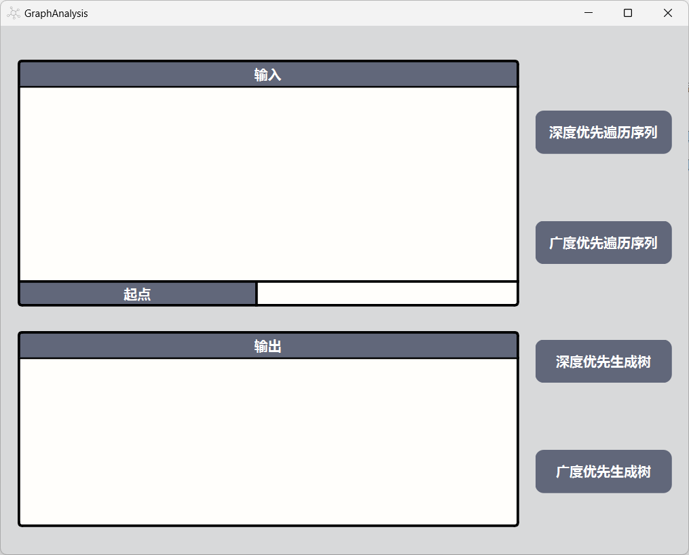
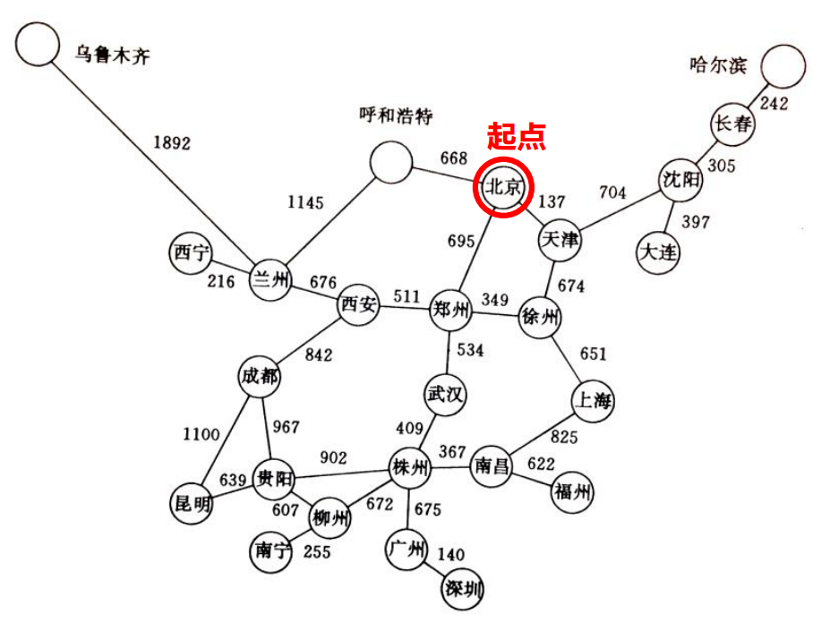
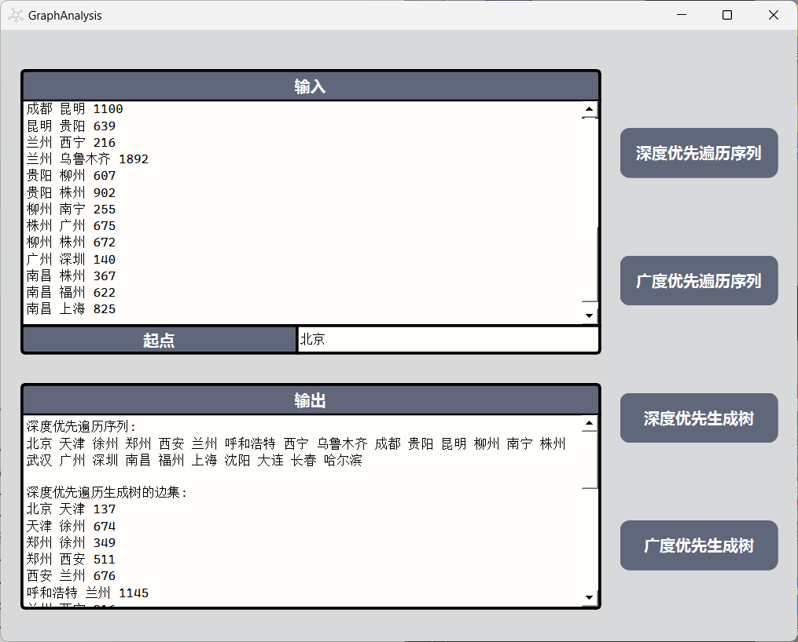
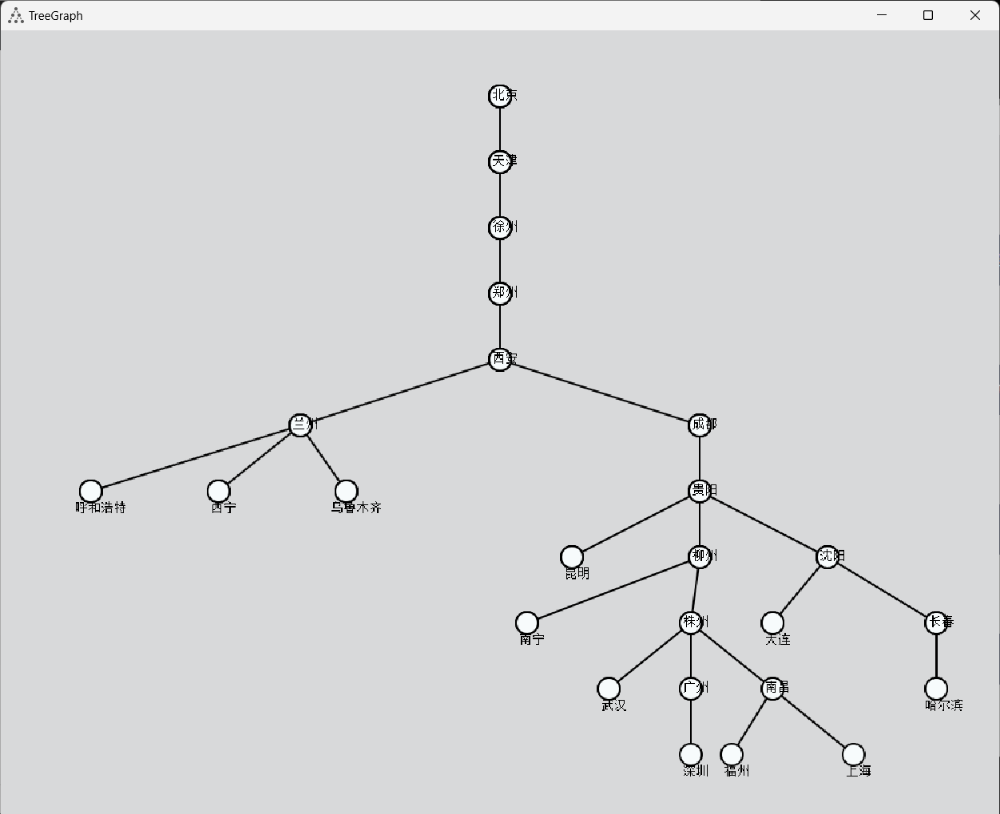
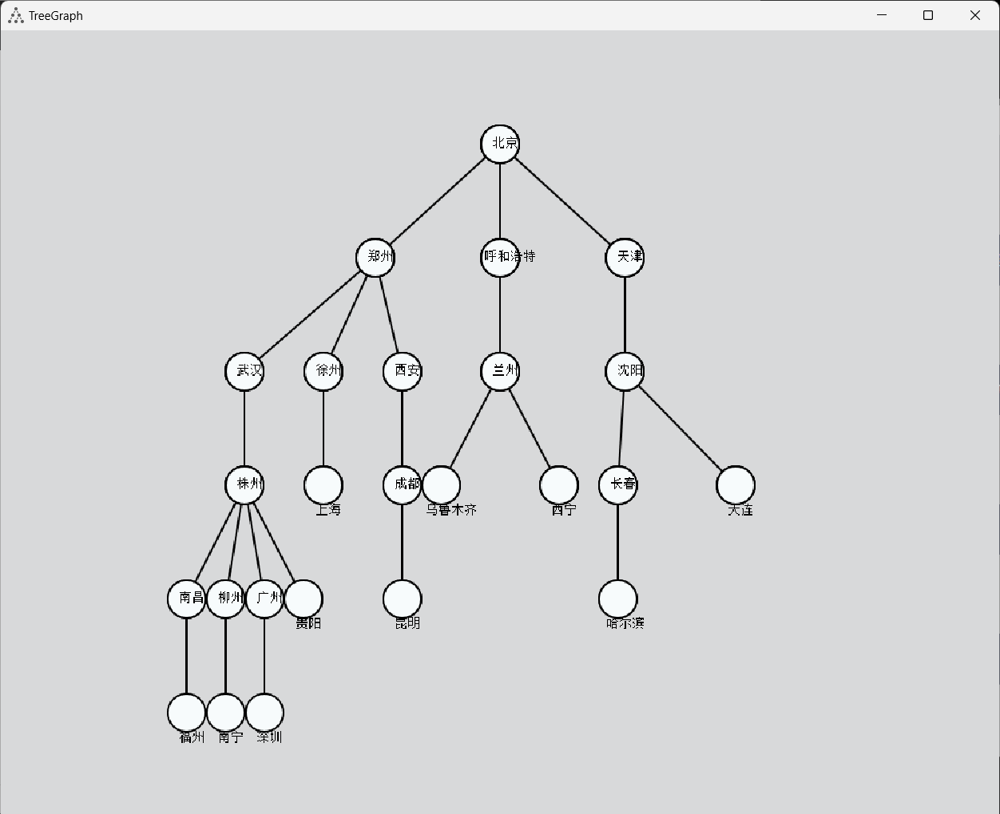
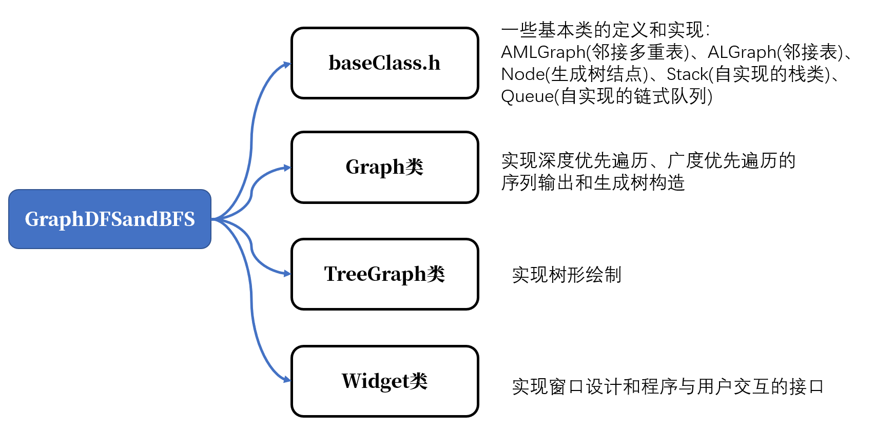

# Project 6 图的遍历

##### 

## 1 程序功能简要说明

### 1.1 程序目的

(1) 以邻接多重表为存储结构，实现联通无向图的深度优先和广度优先遍历。 以指定的结点为起点，分别输出每种遍历下的结点访问序列和相应生成树的边集。 

(2) 借助于栈类型（自行定义和实现），用非递归算法实现深度优先遍历。 

(3) 以邻接表为存储结构，建立深度优先生成树和广度优先生成树，并以树形 输出生成树。


### 1.2 程序功能说明

#### 1.2.1 程序的运行界面



#### 1.2.2 程序的功能（运行方式）说明

* 根据输入的边集，建立图，输入起点，再点击 `深度优先遍历序列`，在输出框中会显示深度优先遍历下的结点访问序列和相应生成树的边集。 点击 `广度优先遍历序列`，在输出框中会显示广度优先遍历下的结点访问序列和相应生成树的边集。 
* 点击 `深度优先生成树` ，会有弹窗，显示的是 根据所给定的边集和起点进行深度优先遍历形成的生成树的图像。
* 点击 `广度优先生成树` ，会有弹窗，显示的是 根据所给定的边集和起点进行广度优先遍历形成的生成树的图像。
* 输入边集格式：`vex1 vex2 weight` 


## 2 程序运行示例

测试环境：Windows 11

测试数据：



输入的数据：

```
北京 天津 137
北京 呼和浩特 668
北京 郑州 695
郑州 西安 511
郑州 徐州 349
郑州 武汉 534
天津 徐州 674
天津 沈阳 704
沈阳 大连 397
沈阳 长春 305
长春 哈尔滨 242
呼和浩特 兰州 1145
西安 兰州 676
西安 成都 842
徐州 上海 651
武汉 株州 409
成都 贵阳 967
成都 昆明 1100
昆明 贵阳 639
兰州 西宁 216
兰州 乌鲁木齐 1892
贵阳 柳州 607
贵阳 株州 902
柳州 南宁 255
株州 广州 675
柳州 株州 672
广州 深圳 140
南昌 株州 367
南昌 福州 622
南昌 上海 825
```

生成 **深度优先遍历序列** ：



输出结果：

```
深度优先遍历序列: 
北京 天津 徐州 郑州 西安 兰州 呼和浩特 西宁 乌鲁木齐 成都 贵阳 昆明 柳州 南宁 株州 武汉 广州 深圳 南昌 福州 上海 沈阳 大连 长春 哈尔滨 

深度优先遍历生成树的边集: 
北京 天津 137
天津 徐州 674
郑州 徐州 349
郑州 西安 511
西安 兰州 676
呼和浩特 兰州 1145
兰州 西宁 216
兰州 乌鲁木齐 1892
西安 成都 842
成都 贵阳 967
昆明 贵阳 639
贵阳 柳州 607
柳州 南宁 255
柳州 株州 672
武汉 株州 409
株州 广州 675
广州 深圳 140
南昌 株州 367
南昌 福州 622
南昌 上海 825
天津 沈阳 704
沈阳 大连 397
沈阳 长春 305
长春 哈尔滨 242
```

生成 **广度优先遍历序列**：


```
广度优先遍历序列: 
北京 郑州 呼和浩特 天津 武汉 徐州 西安 兰州 沈阳 株州 上海 成都 乌鲁木齐 西宁 长春 大连 南昌 柳州 广州 贵阳 昆明 哈尔滨 福州 南宁 深圳 

广度优先遍历生成树的边集: 
北京 郑州 695
北京 呼和浩特 668
北京 天津 137
郑州 武汉 534
郑州 徐州 349
郑州 西安 511
呼和浩特 兰州 1145
天津 沈阳 704
武汉 株州 409
徐州 上海 651
西安 成都 842
兰州 乌鲁木齐 1892
兰州 西宁 216
沈阳 长春 305
沈阳 大连 397
南昌 株州 367
柳州 株州 672
株州 广州 675
贵阳 株州 902
成都 昆明 1100
长春 哈尔滨 242
南昌 福州 622
柳州 南宁 255
广州 深圳 140
```

深度优先生成树：



广度优先生成树：




## 3 程序说明

### 3.1 程序介绍

基于 QT GUI 图像界面，建立的图像数据输入以及图像遍历结果的输入的程序。



### 3.2 源代码说明

#### 3.2.1 `baseClass.h`

`baseClass.h`：一些基本类的定义和实现

简单的边结构 `Edge` ：

```cpp
struct Edge{
    int i, j, w;
    Edge(int i, int j, int w): i(i), j(j), w(w){}
};
```

邻接多重表：在严蔚敏老师写的《数据结构》的邻接多重表的定义基础上进行了数据元素的简化，原来的顶点的 `data` 我都存储在了 `unordered_map<int, std::string> vex` 映射表中，方便后序的各种输出操作。同时还加入了初始化和加入边结点的操作。

```cpp
// 邻接多重表
struct AMLGraph
{
    // 边结点定义，参考了《数据结构》书中定义
    struct EdgeNode{
        int ivex, jvex;
        int weight;
        EdgeNode* ilink, *jlink;
        EdgeNode(){}
        EdgeNode(int ivex, int jvex, int weight):ivex(ivex), jvex(jvex) ,weight(weight), ilink(nullptr), jlink(nullptr){}
    };
	
    // 初始化邻接多重表
    void InitGraph(int vexNum, int edgeNum, std::vector<Edge>& edges)
    {
        vexnum = vexNum, edgenum = edgeNum;
        adjmulist.clear();
        adjmulist.resize(vexnum);
        for(auto& v: adjmulist) v = nullptr;
        for(Edge& e: edges)
        {
            InsertEdge(e.i, e.j, e.w);
        }
    }

    // 加入边结点
    void InsertEdge(int ivex, int jvex, int weight)
    {
        EdgeNode* edge = new EdgeNode(ivex, jvex, weight);

        edge->ilink = adjmulist[ivex];
        adjmulist[ivex] = edge;

        edge->jlink = adjmulist[jvex];
        adjmulist[jvex] = edge;

    }
	// 数据元素
    std::vector<EdgeNode* > adjmulist;// 直接存储了顶点的 firstedge, adjmulist[i]就是结点i的第一个相接的边
    int vexnum;
    int edgenum;
};
```

邻接表：在严蔚敏老师给出的邻接表的实现的基础上进行数据成员的化简合并，同时加入了初始化图和加入边结点的操作。

```cpp
// 邻接表
struct ALGraph{
    struct EdgeNode{
        int next;
        int weight;
        EdgeNode* nextedge;
        EdgeNode(int next, int weight): next(next), weight(weight){}
    };
	// 初始化图
    void InitGraph(int vexNum, int edgeNum, std::vector<Edge>& edges)
    {
        vexnum = vexNum, edgenum = edgeNum;
        vertices.clear();
        vertices.resize(vexnum);
        for(auto& v: vertices) v = nullptr;
        for(Edge& e: edges)
        {
            InsertEdge(e.i, e.j, e.w);
        }
    }
	// 加入边结点
    void InsertEdge(int i, int j, int w)
    {
        EdgeNode* ei = new EdgeNode(i, w);
        EdgeNode* ej = new EdgeNode(j, w);
        ej->nextedge = vertices[i];
        vertices[i] = ej;
        ei->nextedge = vertices[j];
        vertices[j] = ei;
    }

    // 数据元素
    std::vector<EdgeNode*> vertices;
    int vexnum;
    int edgenum;
};
```

自定义的栈类和队列类：均利用链表结构实现的。

```cpp
template <typename ElemType>
class Stack{
private:
    struct Node{
        ElemType e;
        Node* next;
        Node(ElemType e, Node* next = nullptr): e(e), next(next){}
    };

    int sz;
    Node* head;

public:
    Stack(): sz(0), head(nullptr){}

    void push(ElemType e)
    {
        Node* node = new Node(e, head);
        head = node;
        sz++;
    }

    void pop()
    {
        if(!sz)return;
        if(sz == 1)
        {
            delete head;
            head = nullptr;
            sz--;
        }
        else
        {
            Node* temp = head;
            head = head->next;
            delete temp;
            sz--;
        }
    }

    ElemType& top()
    {
        return head->e;
    }

    int size()
    {
        return size;
    }

    bool empty()
    {
        return sz == 0;
    }
};

template <typename ElemType>
class Queue{
private:
    struct Node{
        ElemType data;
        Node* next;
        Node(const ElemType &e, Node* next = nullptr): data(e), next(next){}
    };

    int size;
    Node* head;
    Node* tail;
public:
    Queue(): size(0), head(nullptr), tail(nullptr){}
    void push(const ElemType& e)
    {
        if(head)
        {
            tail->next = new Node(e);
            tail = tail->next;
        }
        else
        {
            head = tail = new Node(e);
        }
        size++;
    }

    void pop()
    {
        if(empty())
        {
            return;
        }
        if(head == tail)
        {
            delete head;
            head = tail = nullptr;
        }
        else
        {
            Node* temp = head;
            head = head->next;
            delete temp;
        }

        size--;
    }

    ElemType& front()
    {
        return head->data;
    }

    bool empty()
    {
        return size==0;
    }

    ~Queue()
    {
        while(head)
        {
            Node* temp = head;
            head = head->next;
            delete temp;
        }
    }
};
```

生成树结点类，采用的是孩子兄弟结点结构：

```cpp
struct Node
{
    int idx;			// 结点下标
    int x, y;			// 绘制树形图的时候结点的坐标
    int childnum;		// 结点的孩子数目
    std::string data;	// 结点对应的数据
    Node *firstchild, *nextsibling;	// 结点的第一个孩子和结点的左边一个兄弟结点
    Node():childnum(0), firstchild(nullptr), nextsibling(nullptr){}
    Node(int idx): idx(idx), childnum(0), firstchild(nullptr), nextsibling(nullptr){}
    Node(int idx, std::string data): idx(idx), childnum(0), data(data), firstchild(nullptr), nextsibling(nullptr){}
};
```


#### 3.2.2 Graph类

`Graph.h` ：

```cpp
class Graph
{
public:
    Graph();
    void InitMembers();						// 初始化数据成员
    void InitGraph(std::string message);	// 根据输入的图像数据，初始化图像
    bool DFSSequence(std::string start);	// 利用 邻接多重表结构 深度优先遍历，获取遍历的序列和边集
    bool BFSSequence(std::string start);	// 利用 邻接多重表结构 广度优先遍历，获取遍历的序列和边集
    bool BuildDFSTree(std::string start);	// 利用 邻接表结构 深度优先遍历，获得生成树
    bool BuildBFSTree(std::string start);	// 利用 邻接表结构 广度优先遍历，获得生成树
    std::string GetDFSSequence();			// 在 DFSSequence 之后调用，获得序列和边集信息的综合得到的文本信息
    std::string GetBFSSequence();			// 在 BFSSequence 之后调用，获得序列和边集信息的综合得到的文本信息
    Node* GetDFSRoot();			// 在 BuildDFSTree 之后调用，获得 深度优先生成树的根结点，之后进行绘制树形图像
    Node* GetBFSRoot(); 		// 在 BuildBFSTree 之后调用，获得 广度优先生成树的根结点，之后进行绘制树形图像


private:
    // 数据成员
    int vexnum;			// 顶点数
    int edgenum;		// 边数
    Node* dfsRoot;		// 深度优先生成树的根结点
    Node* bfsRoot;		// 广度优先生成树的根结点
    ALGraph algraph;	// 邻接表
    AMLGraph amlgraph;	// 邻接多重表
    std::vector<bool> visited;			// 存储结点的访问信息
    std::vector<int> visitVexList;		// 存储访问的顶点序列
    std::vector<Edge> visitEdgeList;	// 存储访问的边序列
    std::vector<Edge> edges;  			// 暂存 边的信息，方便计算图中顶点数目
    std::unordered_map<std::string , int > idx;	// 顶点数据-顶点下标 映射表
    std::unordered_map<int, std::string> vex;	// 顶点下标-顶点数据 映射表
};
```


利用 邻接多重表结构 深度优先遍历，获取遍历的序列和边集：`bool DFSSequence(std::string start); `

```cpp
bool Graph::DFSSequence(std::string start)
{
    if (!idx.count(start)) return false;  // 如果起始节点不在图中，返回false
    InitMembers();

    int s = idx[start];  // 获取起始节点在图中的索引
    Stack<int> vstk;     // 顶点下标栈
    Stack<Edge> estk;    // 边栈，和顶点栈同步出入，存储需要访问的边
    vstk.push(s);        // 将起始顶点入栈

    while (!vstk.empty())
    {
        int now = vstk.top();
        vstk.pop();  // 将顶点出栈

        if (visited[now])  // 如果顶点已经访问过
        {
            if (!estk.empty()) estk.pop();  // 和顶点同步的边同时出栈
            continue;
        }

        visited[now] = true;  // 标记顶点为已访问
        visitVexList.emplace_back(now);  // 将访问过的顶点加入序列

        if (!estk.empty())  // 如果边栈非空（避免 now == 顶点时，边栈为空的情况）
        {
            visitEdgeList.emplace_back(estk.top());
            estk.pop();
        }

        AMLGraph::EdgeNode* edge = amlgraph.adjmulist[now];  // 获取当前顶点的邻接边链表

        while (edge)
        {
            int next = (now == edge->ivex) ? edge->jvex : edge->ivex;

            if (!visited[next])  // 如果邻接顶点未被访问，加入栈中
            {
                vstk.push(next);
                estk.push(Edge(edge->ivex, edge->jvex, edge->weight));
            }

            edge = (now == edge->ivex) ? edge->ilink : edge->jlink;  // 移动到下一条邻接边
        }
    }

    return true;
}
```


利用 邻接多重表结构 广度优先遍历，获取遍历的序列和边集：`bool BFSSequence(std::string start);` 

```cpp
bool Graph::BFSSequence(std::string start)
{
    if (!idx.count(start)) return false;	// 如果起始节点不在图中，返回false
    InitMembers();			// 初始化成员变量
    int s = idx[start];		// 获取起始节点在图中的索引
    Queue<int> vque;		// 顶点下标栈
    Queue<Edge> eque;		// 边栈，和顶点栈同步出入，存储需要访问的边

    // 将起始节点加入顶点队列，并标记为已访问
    vque.push(s);
    visited[s] = true;

    // 广度优先遍历
    while (!vque.empty())
    {
        // 获取当前顶点
        int now = vque.front();
        vque.pop();

        // 将当前顶点加入访问顶点列表
        visitVexList.emplace_back(now);

        // 如果边队列非空，将队首边加入访问边列表并出队
        if (!eque.empty())
        {
            visitEdgeList.emplace_back(eque.front());
            eque.pop();
        }

        // 遍历当前顶点的邻接边
        AMLGraph::EdgeNode* edge = amlgraph.adjmulist[now];
        while (edge)
        {
            // 获取邻接顶点索引
            int next = (now == edge->ivex) ? edge->jvex : edge->ivex;

            // 如果邻接顶点未被访问，将其加入顶点队列和边队列，并标记为已访问
            if (!visited[next])
            {
                vque.push(next);
                eque.push(Edge(edge->ivex, edge->jvex, edge->weight));
                visited[next] = true;
            }
            
            edge = (now == edge->ivex) ? edge->ilink : edge->jlink;	// 移动到下一条邻接边
        }
    }

    // 遍历完成，返回true
    return true;
}
```


构造深度优先遍历树：

```cpp
bool Graph::BuildDFSTree(std::string start)
{
    if (!idx.count(start)) return false;  // 如果起始节点不在图中，返回false
    InitMembers();

    int s = idx[start];  // 获取起始节点在图中的索引
    Stack<int> vstk;     // 顶点下标栈
    Stack<Node*> nstk;   // 与顶点栈同步的父亲结点栈
    dfsRoot = nullptr;   // 初始化深度优先生成树的根节点为nullptr
    vstk.push(s);        // 将起始顶点入栈

    while (!vstk.empty())
    {
        int now = vstk.top();
        vstk.pop();  // 将顶点出栈

        if (visited[now]) continue;  // 如果顶点已经访问过，跳过处理

        visited[now] = true;  // 标记顶点为已访问

        Node* node = new Node(now, vex[now]);  // 创建当前顶点对应的树节点
        if (now == s)
        {
            dfsRoot = node;  // 如果是起始顶点，将其作为树的根节点
        }
        else
        {
            Node* father = nstk.top();  // 获取父节点
            nstk.pop();

            // 将当前节点加入父节点的子节点链表
            if (father->firstchild == nullptr)
            {
                father->firstchild = node;
            }
            else
            {
                Node* child = father->firstchild;
                while (child->nextsibling) child = child->nextsibling;
                child->nextsibling = node;
            }
        }

        ALGraph::EdgeNode* edge = algraph.vertices[now];  // 获取当前顶点的邻接边链表

        while (edge)
        {
            if (!visited[edge->next])
            {
                vstk.push(edge->next);  // 将未访问的邻接顶点入栈
                nstk.push(node);        // 将当前节点入栈，与顶点栈同步
            }
            edge = edge->nextedge;  // 移动到下一条邻接边
        }
    }

    return true;
}
```


构建广度优先遍历树：

```cpp
bool Graph::BuildBFSTree(std::string start)
{
    if(!idx.count(start)) return false;	// 如果起始节点不在图中，返回false
    InitMembers();

    int s = idx[start]; // 获取起始节点在图中的索引
    Queue<int> vque;	// 顶点下标队列 
    Queue<Node*> nque;	// 结点队列，和顶点下标队列同步进出
    bfsRoot = new Node(s, vex[s]);	// 广度优先生成树的根结点
    visited[s] = true;
    vque.push(s), nque.push(bfsRoot);

    while(!vque.empty())
    {
        int now = vque.front();		// 获取当前顶点和对应树节点
        Node* root = nque.front();
        vque.pop(), nque.pop();
        ALGraph::EdgeNode* edge = algraph.vertices[now];

        Node* child  = nullptr;
        while(edge)
        {
            // 如果邻接顶点未被访问，创建对应树节点，并将其加入树中和队列中
            if(!visited[edge->next])
            {
                // 创建对应树节点，并将其加入树中和队列中
                if(child == nullptr)
                {
                    child = new Node(edge->next, vex[edge->next]);
                    root->firstchild = child;
                }
                else
                {
                    child->nextsibling = new Node(edge->next, vex[edge->next]);
                    child = child->nextsibling;
                }
                // 将邻接顶点下标入队列，同时将对应的树节点入队列
                vque.push(edge->next);
                nque.push(child);
                visited[edge->next] = true;	// 标记邻接顶点为已访问
            }
            edge = edge->nextedge;	// 移动到下一条邻接边
        }
    }

    return true;
}
```


## 4 实验总结

这次实验让我对邻接多重表和邻接表的运用更加熟悉。我一开始不怎么了解邻接多重表，平时也是用 邻接矩阵和邻接表来实现图的操作，这次实验，我通过搜索对邻接多重表有了一定的认识，之后再利用邻接多重表实现图的深度优先遍历和广度优先遍历的操作，我对邻接多重表的运用有了更深层次的了解。这次实验使用的邻接表是和书上所介绍的相似利用链表结构实现，我一开始想利用 `vector< vector<pair<int,int>>>` 实现邻接表的，后来觉得这种结构不利于我对邻接表结构的本质的了解和熟悉，所以最后采用的结构是基于书本上介绍的结构进行简化得到的。这次实现在实现生成树的过程中，让我对孩子兄弟表示树的方法以及这种结构下的遍历绘制操作更加熟悉。