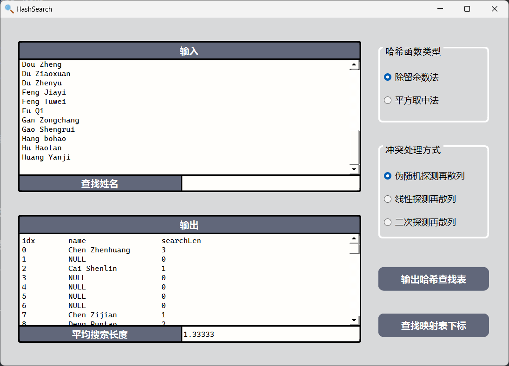

# Project 7 哈希表设计

##### 

## 1 程序功能简要说明

### 1.1 程序目的

针对某个集体（例如是所在的班级）中的“姓名”设计一个哈希表，使得平均查找长度不超过 L，完成相应的建表和查表程序。

### 1.2 程序功能说明

* 可选择哈希函数类型：除留余数法、平方取中法
* 冲突处理的方式：伪随机探测再散列、线性探测再散列、二次探测再散列
* 可以输出不同哈希函数类型+不同冲突处理方式下的哈希查找表
* 可以通过输入查找姓名，输出查找的结果（存在/不存在），如果存在，则输出查找的深度

#### 1.2.1 程序的运行界面


## 2 程序运行示例

测试环境：Windows 11

测试数据：

```
Zhang Yichi
Cai Kehao
Cai Shenlin
Cao Zhixin
Cao Zuyuan
Zeng Zhihao
Zeng Ziying
Chen Xingping
Chen Yuda 
Chen Yuemin 
Chen Zhenhuang 
Chen Zhengxi 
Chen Zhichen 
Wu Yingfei
Chen Zijian
Chen Rikang
Cheng Yongtian
Deng Runtao
Dong Shengfan
Dou Zheng
Du Ziaoxuan
Du Zhenyu
Feng Jiayi
Feng Tuwei
Fu Qi
Gan Zongchang
Gao Shengrui
Hang bohao
Hu Haolan
Huang Yanji
```

除留余数法+伪随机探测再散列法：


输出结果：

```
idx	name		searchLen
0	Chen Zhenhuang 	3
1	NULL		    0
2	Cai Shenlin	    1
3	NULL		    0
4	NULL			0
5	NULL			0
6	NULL			0
7	Chen Zijian		1
8	Deng Runtao		2
9	Cai Kehao		1
10	NULL			0
11	NULL			0
12	NULL			0
13	Gao Shengrui	2
14	NULL			0
15	Chen Rikang		2
16	Huang Yanji		3
17	NULL			0
18	Zhang Yichi		1
19	Chen Zhichen 	1
20	Du Zhenyu		1
21	NULL			0
22	NULL			0
23	NULL			0
24	NULL			0
25	NULL			0
26	NULL			0
27	Zeng Zhihao		1
28	NULL			0
29	NULL			0
30	NULL			0
31	NULL			0
32	NULL			0
33	NULL			0
34	Dong Shengfan	1
35	Hang bohao		1
36	Hu Haolan		1
37	Gan Zongchang	1
38	Cheng Yongtian	1
39	Chen Zhengxi 	1
40	NULL			0
41	Cao Zhixin		1
42	Feng Tuwei		1
43	NULL			0
44	Du Ziaoxuan		1
45	Fu Qi			1
46	NULL			0
47	Chen Xingping	2
48	NULL			0
49	NULL			0
50	Zeng Ziying		1
51	Wu Yingfei		1
52	NULL			0
53	NULL			0	
54	NULL			0
55	Feng Jiayi		2
56	Dou Zheng		1
57	Chen Yuemin 	1
58	Chen Yuda 		2
59	Cao Zuyuan		1
```


查找个人姓名：

 

查看到哈希查找表中的内容，可知输出正确：

 

若姓名不存在：

 


其他哈希函数和冲突处理方式的组合的输出：

 

  

  

可以看出，在处理这个数据集时，伪随机探测再散列的效果比较好，二次探测再散列的效果不是很理想。大部分的平均查找长度都小于2。


## 3 程序说明

### 3.1 程序介绍

基于 QT GUI 图像界面，实现哈希查找表功能。

 


### 3.2 源代码说明

哈希表功能集合在 `Hash` 类中，类声明：

```cpp
#define HTSIZE 60  // 哈希表容量

class Hash
{
public:
    Hash();
    Hash(std::string message, int mapMode, int collisionTackleMode, int datasize);
    // 将信息插入哈希表
    void Insert(std::string text, int mapMode, int collisionTackleMode);
    int midSquare(int num);     // 平方取中法 下标计算

    std::string MapMessage();   // 获取哈希查找表信息
    double averageSearchLen();  // 平均查找长度
    // 查找单个信息
    std::pair<int, int> GetMessage(std::string name, int mapMode, int collisionTackleMode);

private:
    std::vector<std::string> hashTable;
    std::vector<int> searchLen;
    int sum_sl;
    int sz;
};
```

哈希查找表的构造函数：

```cpp
Hash::Hash(std::string message, int mapMode, int collisionTackleMode, int datasize)
{
    sz = datasize;
    hashTable.resize(HTSIZE);
    searchLen.resize(HTSIZE);
    hashTable.assign(HTSIZE,"");
    searchLen.assign(HTSIZE, 0);
    sum_sl = 0;
	// 读取数据，把每行的姓名存入哈希查找表中
    std::istringstream iss(message);
    std::string name;
    while(std::getline(iss, name))
    {
        Insert(name, mapMode, collisionTackleMode);
    }
}
```


把姓名信息存入哈希查找表：

```cpp
void Hash::Insert(std::string text, int mapMode, int collisionTackleMode)
{
    int idx;				// 记录数据在查找表中的位置
    int num = 0;			// 作为数据的 key 值
    for(char& c: text) num += (int)c;		// 把所有字符的 ascii 十进制码相加得到 key 值
    idx = num % HTSIZE;     // 除留余数法

    if(mapMode == 2)        // 平方取中法
    {
        idx = (midSquare(num))% HTSIZE;
    }

    int sl = 1;				// 查找长度
    while(hashTable[idx].length() != 0)
    {
        if(collisionTackleMode == 1)        // 伪随机探测再散列法
        {
            idx = ((idx * 1103515245%600 + 12345) & 0xFFFFFFFF) % HTSIZE;
        }
        else if(collisionTackleMode == 2)   // 线性探测再散列法
        {
            idx = (idx+1) % HTSIZE;
        }
        else if(collisionTackleMode == 3)   // 平方探测再散列法
        {
            idx = ((int)(idx+pow(-1, sl)*pow(sl/2, 2))) % HTSIZE;
        }
        sl++;
    }

    hashTable[idx] = text;
    searchLen[idx] = sl;
    sum_sl+=sl;
}

// 平方取中法
int Hash::midSquare(int num)
{
    long long squared = static_cast<long long>(num) * static_cast<long long>(num);
    std::string squaredStr = std::to_string(squared);

    int midIndex = (squaredStr.length() / 2) - 2;
    std::string hashStr = squaredStr.substr(midIndex, 3);

    return std::stoi(hashStr);
}
```

获取所要查找姓名的信息：

下标的计算和存入哈希表的一样。

```cpp
std::pair<int, int> Hash::GetMessage(std::string text, int mapMode, int collisionTackleMode)
{
    int idx;
    int num = 0;
    for(char& c: text) num += (int)c;


    idx = num % HTSIZE;     // 除留余数法

    if(mapMode == 2)        // 平方取中法
    {
        idx = (midSquare(num))% HTSIZE;
    }

    int temp = 1;
    while(hashTable[idx].length() && hashTable[idx] != text)	// 若该位置上有字符串且字符串不等于所输入的信息
    {
        // 根据不同的冲突处理方式得到 idx
        if(collisionTackleMode == 1)
        {
            idx = ((idx * 1103515245%600 + 12345) & 0xFFFFFFFF) % HTSIZE;
        }
        else if(collisionTackleMode == 2)
        {
            idx = (idx+1) % HTSIZE;
        }
        else if(collisionTackleMode == 3)
        {
            idx = (int)(idx+pow(-1, temp)*pow(temp/2, 2)) % HTSIZE;
            temp++;
        }
    }
    if(hashTable[idx].length())	 // 如果字符串不为空
        return std::make_pair(idx, searchLen[idx]);
    return std::make_pair(-1,0); // 如果字符串为空，说明不在查找表中
}
```

输出哈希查找表信息：

```cpp
std::string Hash::MapMessage()
{
    std::string message;

    message += std::string("idx") + '\t' + "name" + "\t\t" + "searchLen" + "\n";

    for(int i = 0; i<HTSIZE; i++)
    {
        message += std::to_string(i);
        message += '\t';
        message += (hashTable[i].length())? (hashTable[i].length() <= 10 ? hashTable[i] + '\t' :  hashTable[i] ): "NULL\t";
        message += '\t';
        message += std::to_string(searchLen[i]);
        message += '\n';
    }

    return message;
}
```

输出平均查找长度：

```cpp
double Hash::averageSearchLen()
{
    return (double)sum_sl/sz;
}
```


## 4 实验总结

这次实验让我对哈希表的设计和实现更加熟悉。同时，我对不同方式实现哈希查找和解决冲突也有了一定的理解。通过对比平均查找长度，我对不同冲突处理方式的性能有了一定的了解。
